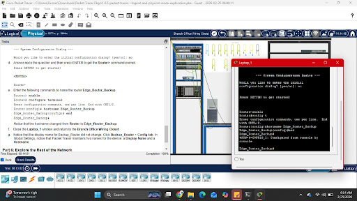

# 🧪 Lab Report: 1.0.5 Logical and Physical Mode Exploration

## 📝 Description

Exploration of Cisco Packet Tracer's dual-view system, moving from a Logical topology to a Physical deployment. This included an additional requirement to perform basic CLI identification for backup infrastructure.

---

## 🎯 CCNA Objectives

- **1.2:** Network topology architectures.
- **1.3:** Physical interface and cabling types.
- **1.1:** Role and function of network components (Routers).

---

## 🛠️ Hands-On Skills

| Skill | Application |
|-------|-------------|
| Logical Navigation | Visualizing data flow between end devices and switches. |
| Physical Placement | Organizing hardware in server racks and wiring closets. |
| Device Identification | Configuring a hostname for the backup router via CLI. |

---

## 🔍 Lab Reflection

- **Router Naming:** Setting a unique hostname (e.g., `Router-Backup`) is critical for administrative clarity and security logging.
- **Layer 1 Simulation:** Improper cabling in Physical mode results in link light failures, simulating real-world hardware errors.

---

## 🖼️ Screenshot Evidence

> Insert screenshot below:



---

## 📈 Results

- **Status:** 🟢 Completed
- **Completion:** 100%
- **Date:** 2026-02-25
```
