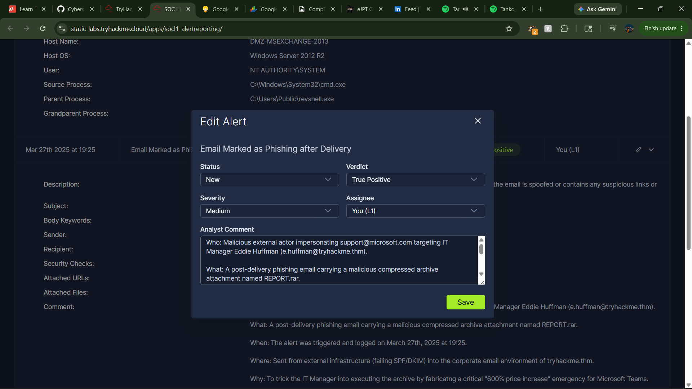
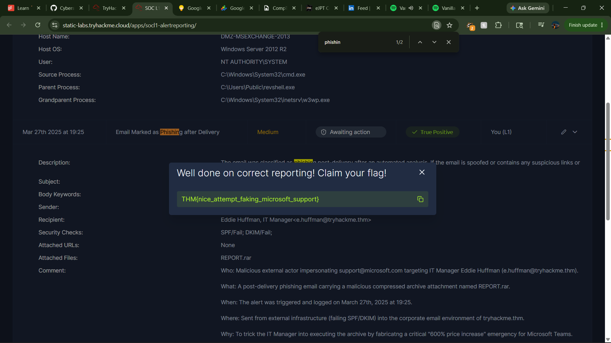

## From Detection to Action: Mastering the Core of SOC Alert Reporting

Once a cybersecurity analyst catches a verified threat, the work isn't done. Finding an attack matters very little if you can't communicate it effectively to the team members who need to contain it. 

I just completed the **[SOC L1 Alert Reporting](https://tryhackme.com/room/socl1alertreporting)** practical lab, shifting focus from pure threat detection to the critical next step: structural documentation, rapid escalation, and crisis communication.

### The Why (The Core Problem)
When an organization is experiencing a live security breach, time is the absolute enemy. If a Tier 1 analyst simply flags an alert as dangerous without context, senior incident responders have to waste precious minutes re-investigating from scratch. Clear reporting bridges the gap between spotting a threat and stopping it.

### The Process (How It Works)
The workflow used to handle a confirmed security incident follows three strict phases:
* **The 5 Ws Documentation:** Every incident report must answer five core questions. Who targeted the system, what exact malicious actions occurred, when did the event take place, where are the affected assets or external URLs, and why is this classified as a true threat.
* **Direct Escalation:** Once the report is structured, ownership must be assigned properly. In the practical dashboard, I moved the active ticket to an in-progress state, documented the 5 Ws, and escalated the ticket directly to the senior analyst on shift, E. Fleming, to begin remediation.
* **Crisis Communication Protocols:** I evaluated guidelines for high-pressure scenarios, such as using out-of-band communication (like phone calls) if primary messaging channels are compromised, and following a strict chain of command to escalate issues smoothly without causing internal chaos.

### The Result (The Takeaway)
By applying the 5 Ws framework and proper escalation paths, I successfully handed off a critical incident ticket to Tier 2 support, hitting a **57-day learning streak** and finishing the module. 

Technical detection skills are highly valuable, but pairing them with clear, structured communication is what truly minimizes downtime and protects enterprise infrastructure.

#Cybersecurity #SOC #IncidentResponse #BlueTeam #TechCommunication #ContinuousLearning
