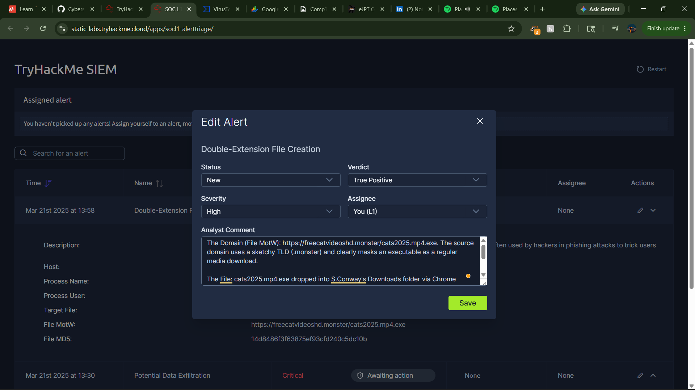
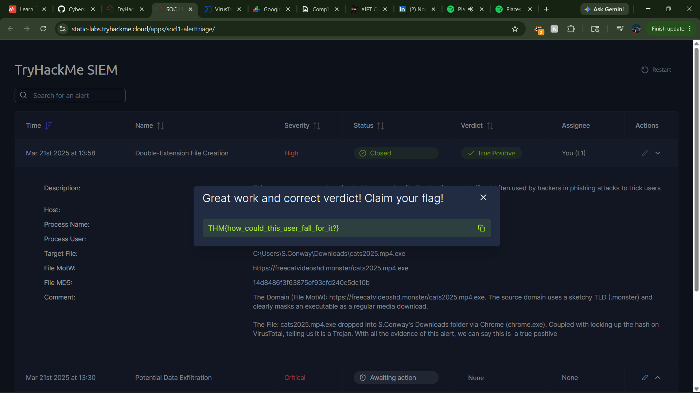

## Transforming Security Chaos into Order: A Lesson in SOC Alert Triage

When a cyber attack happens, security tools generate thousands of data points every single second. For a Tier 1 Security Operations Center (SOC) analyst, the biggest challenge isn't finding data, it is separating the real threats from the harmless background noise. 

I just wrapped up a practical lab environment covering the core fundamentals of **Alert Triage** and **Prioritization**, and here is a quick breakdown of how security teams keep organizations safe.

### The Why (The Core Problem)
If every single notification is treated with the same level of urgency, analysts burn out, and critical threats slip through the cracks. The entire goal of triage is to establish a systematic, repeatable process to identify high-risk incidents immediately and ignore the false alarms.

### The Process (How It Works)
The workflow follows three specific phases to handle an incoming queue:
* **Analyzing Alert Properties:** Every notification contains crucial metadata. Analysts look at the exact rule triggered, timestamps, user context, and artifact values (such as file paths or command lines) to determine if the activity is a True Positive (a real threat) or a False Positive (benign activity).
* **Applying Strict Prioritization:** Instead of handling alerts randomly, rules are sorted mathematically. Unassigned tasks are filtered first, critical or high severity alerts take precedence over low ones, and older pending alerts are prioritized over brand-new ones to stop an active adversary from advancing further.
* **Managing the Lifecycle:** Security issues are tracked dynamically using service management frameworks. Alerts are moved from *New* to *In Progress* once claimed, ensuring proper ownership and preventing multiple analysts from duplicating the exact same work.

### The Result (The Takeaway)
By applying these exact sorting and evaluation rules inside the lab dashboard, I successfully isolated a high-severity threat: a **Potential Data Exfiltration** attempt. 

Mastering this triage lifecycle is what allows modern security teams to move past the noise, take ownership of critical incidents quickly, and protect infrastructure before damage is done.

Proof

#Cybersecurity #SOC #BlueTeam #IncidentResponse #ThreatHunting #ContinuousLearning
