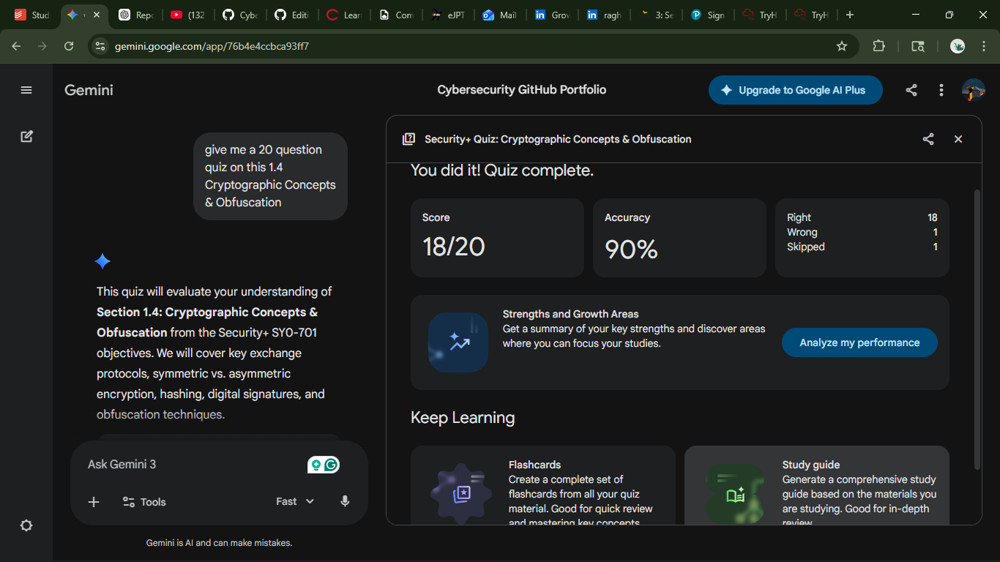
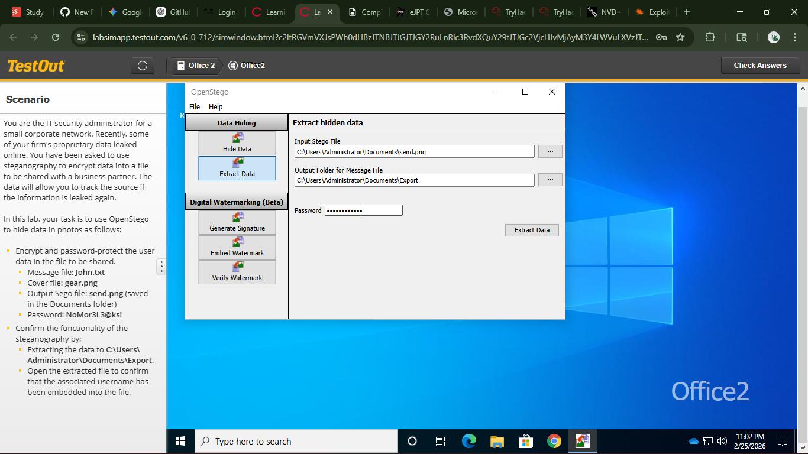

# 🧪 Sec+ Study Report: 1.4 Cryptographic Concepts & Obfuscation

## 📝 Description

Analyzed core Security+ concepts regarding data protection and verification. This session covered **Obfuscation** (hiding data in plain sight) and **Cryptography** (ensuring integrity and authenticity through hashing and digital signatures).

## 🎯 Security+ Objectives

* **SY0-701 1.4:** Compare and contrast various types of security controls (Technical/Cryptographic).
* **Data Integrity:** Ensuring information remains unaltered.
* **Non-Repudiation:** Providing proof of origin that cannot be denied.

---

## 🛠️ Key Concepts & Skills

| Technique | Application | Benefit |
| --- | --- | --- |
| **Steganography** | Hiding text/data inside images or audio files. | Security through obscurity. |
| **Tokenization** | Replacing sensitive data (CC numbers) with a random "token." | Substitution without encryption. |
| **Hashing** | Generating a unique string (SHA-256) to represent data. | **Integrity** (Digital Fingerprint). |
| **Salting** | Adding random data to passwords before hashing. | Defeats **Rainbow Table** attacks. |
| **Digital Signatures** | Encrypting a hash with a **Private Key**. | Authentication & Non-repudiation. |

---

## 🔍 Study Reflection

* **Obfuscation vs. Encryption:** Obfuscation makes data hard to read but is reversible without a key; Encryption requires a specific mathematical key for reversal.
* **Hashing Collisions:** Occur when two different inputs produce the same hash (e.g., md5). Modern standards like **SHA-256** are used to prevent this.
* **Digital Signature Flow:**  
  1. Signer uses **Private Key** to encrypt a hash.  
  2. Recipient uses Signer's **Public Key** to decrypt and verify.

---

## 📈 Results

* **Status:** 🟢 Completed
* **Quiz Score:** 20/20 (Mastery)
* **Date:** 2026-02-25

## 📸 Proof of Work Quiz + Lab Evidence

### 🔐 Obfuscation Lab – Sec+ Pro v8 :"

**Lab Environment:** Sec+ Pro v8  
**Objective:** Demonstrate practical implementation of obfuscation techniques.

📎 **Screenshot Evidence:**  

