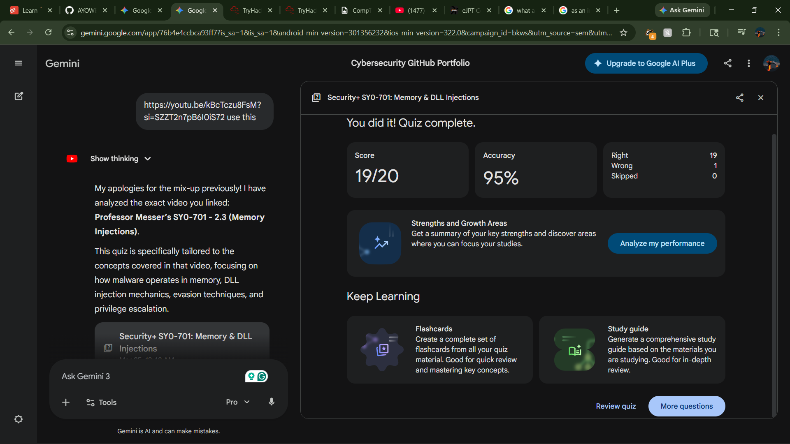

# 🛡️ Security+ SY0-701 Lab/Quiz Report: Memory & DLL Injections (Domain 2.3)

## 🎯 Key Points Studied
This module covered the mechanics, risks, and evasion tactics associated with Memory and DLL (Dynamic Link Library) injections. The core concepts tested include:
*  **Execution Fundamentals:** The requirement that all code (legitimate or malicious) must be loaded from storage into RAM to be processed by the CPU.
*  **DLL Architecture:** How Windows uses shared libraries to operate, making them an attractive target for "living off the land" attacks.
*  **Injection Mechanics:** The multi-step process of placing a malicious DLL on disk and inserting its file path into the memory space of a legitimate target process.
*  **Privilege Escalation:** How injected malware inherits the access rights of its host process (e.g., targeting `svchost.exe` to gain `NT AUTHORITY\SYSTEM` access).
*  **Evasion:** Using memory injection to bypass Application Whitelisting and standard Endpoint Detection and Response (EDR) tools by hiding within trusted executables.

---

## 🧠 High-Impact Question Analysis

**1. Evasion Tactics (Question 3)**
* **Analysis:** Emphasizes why attackers prefer injection over standalone executables. By hiding malicious code inside a trusted, already-running process, the malware avoids detection by traditional signature-based antivirus tools that look for unfamiliar `.exe` files.

**2. Inherited Permissions (Question 4)**
* **Analysis:** A critical security concept—the operating system does not distinguish between the original code and the injected code. The malware automatically operates with the exact same rights and permissions as the compromised host process.

**3. Privilege Escalation (Question 5)**
* **Analysis:** Highlights the strategic targeting of administrative processes. Injecting into a high-level system process grants the attacker immediate privilege escalation, allowing for deep system manipulation.

**4. The Mechanism of Loading (Question 8)**
* **Analysis:** Breaks down the actual technical trigger. The attacker manipulates the execution flow by inserting a specific file path into the target process's memory space, which forces the host application to pull the malicious DLL from disk.

**5. Bypassing Application Whitelisting (Question 10)**
* **Analysis:** Tests the understanding of defensive limitations. Strict `.exe` whitelisting fails against memory injection because the executing host application (like a web browser) is already on the approved list.

**6. "Living Off the Land" (Question 12)**
* **Analysis:** Focuses on the architectural vulnerability of Windows. Because the OS heavily relies on dynamic linking for normal operations, attackers are simply abusing a required, built-in feature rather than introducing completely foreign mechanics.

**7. Execution Fundamentals (Question 18)**
* **Analysis:** Reinforces the absolute rule of computing execution: malware cannot execute directly from the hard drive. It must cross the boundary from persistent storage into active memory to function.

**8. The Ultimate Goal (Question 20)**
* **Analysis:** Summarizes the entire attack vector. The end goal of placing a path inside a process is to achieve seamless, fully-permissioned execution of malicious code under the flawless disguise of a trusted application.

---

## 📚 Reference Material
* **Video Source:** Professor Messer - Memory Injections - CompTIA Security+ SY0-701 - 2.3
* **URL:** `https://youtu.be/kBcTczu8FsM?si=SZZT2n7pB6I0iS72`

---

## ✅ Proof of Completion

---

* 📅 **Date Completed:** 2026-03-25

