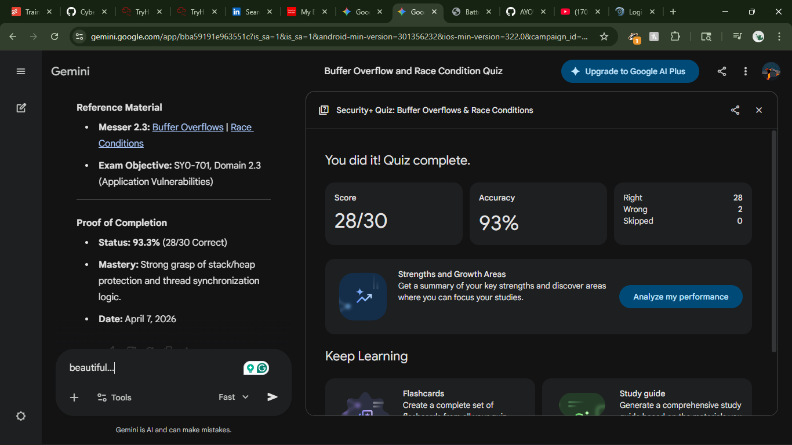

## 🛡️ Sec+ Quiz Report: Buffer Overflows & Race Conditions

### 📝 Study & Test Summary

  * **Buffer Overflows:** Focused on memory boundary violations, return address manipulation, and mitigations (**ASLR**, **DEP**, **Canaries**).
  * **Race Conditions:** Covered **TOC/TOU** timing gaps, shared resource conflicts, and synchronization via **Mutexes/Locks**.

-----

### 🔍 High Impact Question Analysis

| \# | Topic | Key Insight |
| :--- | :--- | :--- |
| 1 | **DEP** | Marks data memory as non-executable to block malicious payloads. |
| 2 | **ASLR** | Randomizes memory addresses to prevent predictable jump targets. |
| 3 | **Critical Section** | Shared code area that requires thread locking to prevent race conditions. |
| 4 | **Stack Canary** | Detection value placed before the return address to catch overflows. |
| 5 | **Return Address** | Target of stack overflows used to redirect program execution flow. |
| 6 | **TOC/TOU** | Exploit exploiting the delay between permission check and file use. |
| 7 | **Memory Safety** | Languages like **C** are prone to overflows; **Java/Python** are safer. |
| 8 | **Deadlock** | Result of circular locking dependencies between competing threads. |

-----

### 📚 Reference Material

  * ** Professor Messer 2.3:** [Buffer Overflows](https://www.google.com/search?q=https://youtu.be/0-qeeI5jTqU) | [Race Conditions](https://www.google.com/search?q=https://youtu.be/MKptc1lPSw8)
  * **Exam Objective:** SY0-701, Domain 2.3 (Application Vulnerabilities)

-----

### ✅ Proof of Completion
  * **
  * **Status:** **93.3%** (28/30 Correct)
  * **Mastery:** Strong grasp of stack/heap protection and thread synchronization logic.
  * **Date:** April 7, 2026
