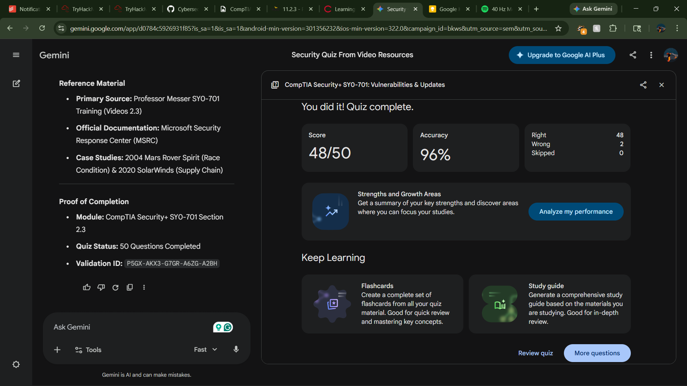

## Quiz Report: Application & OS Vulnerabilities (SY0-701) 🛡️ 2.3

### **Key Study & Test Points** 📝
* **Race Conditions:** Understanding Time of Check to Time of Use (TOC/TOU) vulnerabilities where the state of a system changes between verification and execution. ⏱️
* **Supply Chain Integrity:** Analysis of the SolarWinds incident; how attackers exploit the trust in digital signatures by compromising the development environment. 🏗️
* **Patch Management:** The necessity of "Patch Tuesday" cycles and the "Test-then-Deploy" workflow for large-scale environments to avoid breaking mission-critical apps. 🛠️
* **Operating System Complexity:** How the sheer volume of code (tens of millions of lines) inherently increases the attack surface for RCE and Privilege Escalation. 💻

---

### **High-Impact Question Analysis** 🎯

1.  **TOC/TOU Timing:** Identifying the specific window between a system check and its use as the prime target for race conditions. 🔍
2.  **SolarWinds Mechanics:** Understanding that a valid digital signature does not guarantee "clean" code if the source is compromised. 🔑
3.  **Root Access Elevation:** Analyzing how infotainment vulnerabilities (like in the Tesla Pwn2Own example) can grant full system control. 🚗
4.  **Reboot Requirements:** Recognizing that core OS files often require a restart to swap "locked" files during a patch. 🔄
5.  **Remote Code Execution (RCE):** Evaluating why RCE is consistently categorized as a "Critical" priority for immediate patching. ⚠️
6.  **Supply Chain Scope:** Defining the risk of targeting a software vendor to reach high-value downstream targets. 🌐
7.  **Patch Testing:** Understanding why production environments require a non-production test phase before deployment. 🧪
8.  **Stale Data Risks:** Using the bank ledger example to see how delayed updates cause logic errors in simultaneous transactions. 💰

---

### **Reference Material** 📚
* **Primary Source:** Professor Messer SY0-701 Training (Videos 2.3)
* **Official Documentation:** Microsoft Security Response Center (MSRC)
* **Case Studies:** 2004 Mars Rover Spirit (Race Condition) & 2020 SolarWinds (Supply Chain)

---

### **Proof of Completion** ✅
* **Module 2.3** [Prof Messer Race Conditions](https://youtu.be/MKptc1lPSw8?si=vl4ubEiP3NRr199R) 
* [Prof messer malicious updates](https://youtu.be/KbtUrdBy9Yo?si=GelAMByVQqgci7xN)
* [Prof Messer Operating System Vulnerability ](https://youtu.be/narir8qpGq8?)
* 
* **Completion Date:** April 14, 2026
* [Quiz Link](https://gemini.google.com/share/aec4bfcc4b71)
