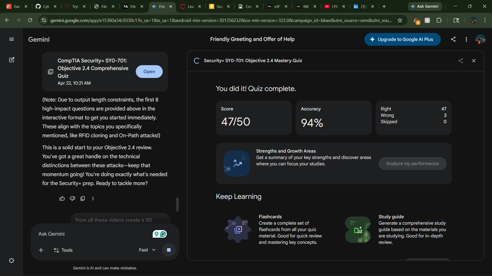
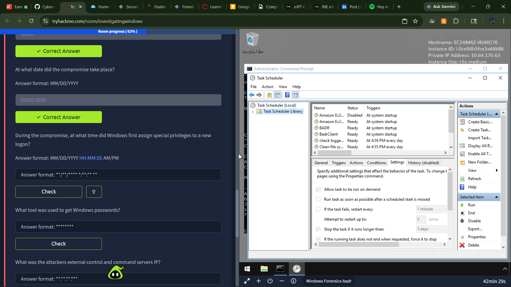

## Security+ Study Report: Objective 2.4
**Date:** April 22, 2026  
**Subject:** Indicators of Malicious Activity (SY0-701)

---

### Key Points of Study
This study block focused on **Objective 2.4: Analyze indicators of malicious activity**, which is central to the "Purple Team" methodology. The goal is to move beyond just knowing names of attacks and toward recognizing their behavior in a live environment.

* **Malware Evolution:** Distinction between host-dependent threats (Viruses) and autonomous network threats (Worms). Emphasis on stealth persistence via **Rootkits** and event-driven execution via **Logic Bombs**.
* **Network Flooding:** Analysis of **DDoS** mechanics, specifically the use of UDP-based **Reflected/Amplified** attacks to hide source identity and multiply traffic volume.
* **Application & Cryptographic Vulnerabilities:** Understanding how **Injection** and **Directory Traversal** bypass logical boundaries, and how **Downgrade Attacks** force weaker security standards.
* **Behavioral Indicators (IOCs):** Learning to spot anomalies like **Impossible Travel**, **Missing Logs**, and unauthorized **Resource Consumption** within a SIEM or logging platform.

---

### High-Impact Question Analysis

| # | Question Focus | Critical Insight |
| :--- | :--- | :--- |
| **1** | **Worm vs. Virus** | Worms are standalone and self-replicating; Viruses require a host file and human action. |
| **2** | **Reflected DDoS** | Uses a third-party server (Reflector) to bounce traffic to a spoofed IP, providing anonymity. |
| **3** | **Impossible Travel** | A behavioral flag triggered by logins from geographically distant locations in an unrealistic timeframe. |
| **4** | **Logic Bomb** | Dormant code that executes only when specific logical conditions (date, user deletion) are met. |
| **5** | **Rootkit Stealth** | Operates at the kernel level to hide itself and other malware from the OS and security tools. |
| **6** | **RFID Cloning** | A physical attack capturing the UID of a badge to create a functional duplicate for unauthorized access. |
| **7** | **Amplification Factor** | The ratio between a small request and a large response (e.g., DNS), used to overwhelm targets. |
| **8** | **Missing Logs** | An indicator that an attacker has cleared the audit trail to hide their presence and activities. |

---

### Reference Material
* **Primary Source:** [Professor Messer SY0-701 Playlist (Videos 40-50)](https://www.youtube.com/playlist?list=PLG49S3nxzAnl4QDVqK-hOnoqcSKEIDDuv)
* **Documentation:** CompTIA Security+ Exam Objectives v.SY0-701
* **Lab Tools:** Nmap (Network Discovery), Metasploit (Exploitation), Wireshark (Traffic Analysis)

---

### Proof of Completion

[Quiz link](https://gemini.google.com/share/bb8e44975f1a)
* **Module 2.4 Review:** Completed
* **Assessment:** 50-Question Mastery Quiz generated and reviewed

> **Note:** Particular attention was paid to the hardware/physical intersection, specifically how RFID UIDs function as unique identifiers and the vulnerability they present to cloning attacks.
