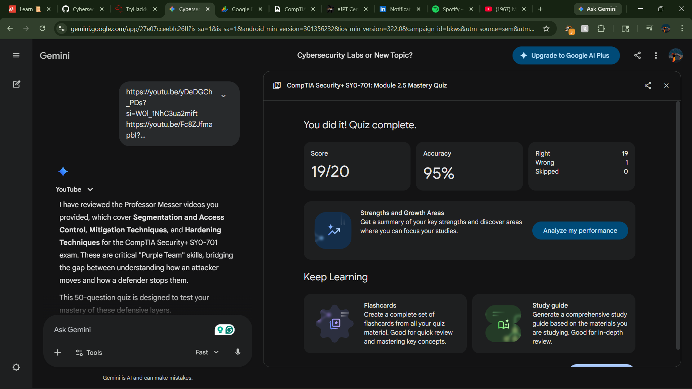
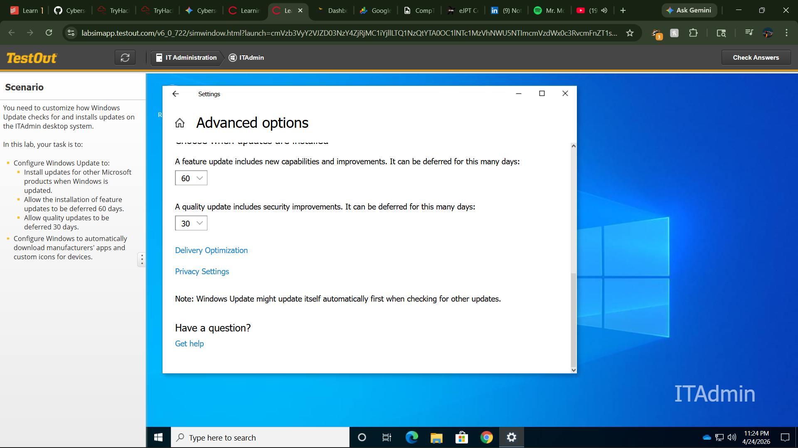

### **Quiz Completion Report: Sec+ SY0-701 Module 2.5**

---

#### **1. Study & Test Summary**
Focused on **Module 2.5: Segmentation Mitigation & Hardening**, covering the technical implementation of defensive layers to reduce attack surfaces and restrict lateral movement.

**Key Concepts:**
* **Segmentation:** Logical (VLANs/PCI DSS) and Physical isolation.
* **Access Control:** ACLs, Application Allow/Deny lists, and file hashing.
* **Mitigation:** SIEM log consolidation, patch cycles, and NAC posture assessments.
* **Hardening:** EDR behavioral analysis, Host-based firewalls/IPS, and port security.

---

#### **2. High-Impact Question Analysis**

| # | Topic | Key Insight |
| :--- | :--- | :--- |
| **1** | **VLANs** | VLANs provide logical segmentation on shared hardware. |
| **2** | **Hashing** | Hashes ensure application integrity; modified files won't execute. |
| **3** | **EDR vs AV** | EDR uses behavioral analysis; AV relies on static signatures. |
| **4** | **Host Firewall** | Has visibility into data after host-level decryption occurs. |
| **5** | **Posture Check** | Validates device health (patches/AV) before network admission. |
| **6** | **SIEM** | Centralizes logs from disparate systems for unified monitoring. |
| **7** | **Least Privilege** | Restricts permissions to job necessity to limit breach scope. |
| **8** | **Sanitization** | Balancing reuse (formatting) vs. absolute data destruction. |

---

#### **3. Reference Material**
* **Professor Messer SY0-701:** Videos 2.5.1 – 2.5.3.
* **CompTIA Objectives:** Domain 2.0 (Architecture and Design).

---

#### **4. Proof of Completion**

