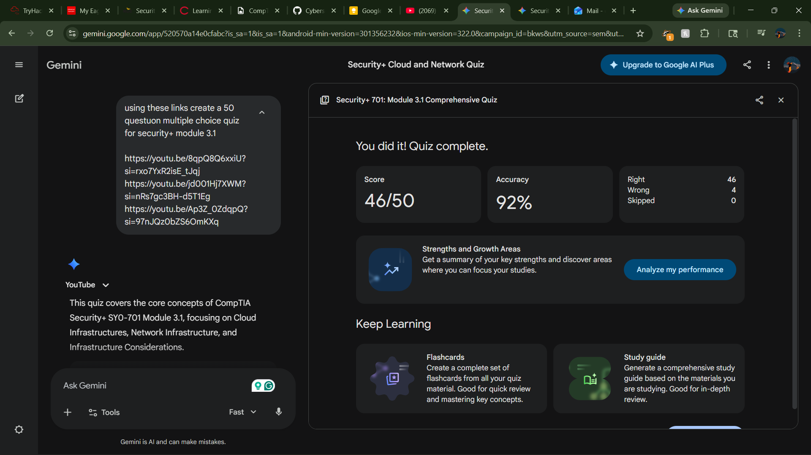

# Study Report: CompTIA Security+ Module 3.1
## Cloud Infrastructures and Network Concepts

**Date:** April 30, 2026
**Subject:** Module 3.1 - Cloud and Network Infrastructure Considerations
**Resource Materials:** Professor Messer SY0-701 Training Videos (Cloud Infrastructures, Network Concepts, Infrastructure Considerations)

---

## 1. Executive Summary of Study
This module covers the architectural foundations of modern IT environments. Key focus areas include:
- **The Shared Responsibility Model:** Understanding the demarcation between what the Cloud Service Provider (CSP) manages (Hardware, Hypervisor, Physical Security) vs. what the Customer manages (Data, Accounts, and often the OS).
- **Architecture Styles:** Transitioning from Monolithic applications to Microservices and Serverless (FaaS) to enhance scalability and resilience.
- **SDN Planes:** The separation of Networking into the **Data Plane** (forwarding), **Control Plane** (routing logic), and **Management Plane** (configuration).
- **Operational Metrics:** Using MTTR (Mean Time to Repair) and Elasticity to measure and manage system availability and responsiveness.

---

## 2. High Impact Question Analysis

| # | Question Focus | Core Concept | Impact Analysis |
|:--|:---|:---|:---|
| 1 | IaaS Responsibility | Guest OS Security | Critical for understanding that IaaS does *not* include OS patching by the provider. |
| 2 | Infrastructure as Code | Automation/IaC | High impact on scalability; essential for "Purple Team" automation skills. |
| 3 | SDN Planes (Data) | Packet Forwarding | Fundamental for networking troubleshooting and traffic flow analysis. |
| 4 | Microservices | Resilience/APIs | Essential for modern app security; focuses on reducing the blast radius of a failure. |
| 5 | Air Gapping | Physical Isolation | The gold standard for securing high-sensitivity systems (e.g., ICS/SCADA). |
| 6 | Elasticity | Dynamic Scaling | Crucial for availability; prevents DoS due to resource exhaustion. |
| 7 | Risk Transference | Cyber Insurance | Important for business-level security strategy and risk management. |
| 8 | Management Plane | Administrative Access | Focuses on securing the 'keys to the kingdom' (SSH/API access to infra). |

---

## 3. Key Concepts Studied & Tested
- **Segmentation:** Using VLANs for logical separation and Air Gaps for physical isolation.
- **Cloud Models:** SaaS (highly managed), PaaS (platform managed), and IaaS (infrastructure provided).
- **SDN:** Software-Defined Networking allows for programmatic control of the network stack.
- **Infrastructure Considerations:** Managing power (UPS/Generators), cost (CapEx vs. OpEx), and recovery (Imaging vs. Fresh Install).

---

## 4. Reference Material
- [Professor Messer SY0-701 - 3.1 Cloud Infrastructures](https://youtu.be/8qpQ8Q6xxiU)
- [Professor Messer SY0-701 - 3.1 Network Concepts](https://youtu.be/jd001Hj7XWM)
- [Professor Messer SY0-701 - 3.1 Infrastructure Considerations](https://youtu.be/Ap3Z_0ZdqpQ)

---

## 5. Proof of Completion
- **Quiz Status:** Completed
- **Total Questions:** 50
- **Assessment Type:** Multiple Choice (Knowledge & Application)

