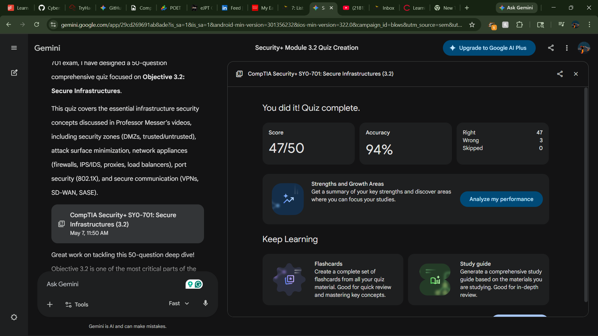

## Quiz Performance Report: Secure Infrastructures (Module 3.2)

### Study & Test Summary
This module focused on the architectural design of secure networks, emphasizing network segmentation and the deployment of security appliances. Key study points included the use of screened subnets (DMZs) to isolate public-facing servers, the implementation of 802.1X for port-based access control, and the functional differences between forward and reverse proxies. The testing phase evaluated the ability to select appropriate hardware—such as Web Application Firewalls (WAFs) for Layer 7 protection—and an understanding of the operational impact of fail-open versus fail-close configurations.

---

### 8 High-Impact Question Analysis

| # | Question Focus | Key Analysis & Study Point |
| :--- | :--- | :--- |
| **1** | **Appliance Failure** | **Fail Close** is critical for high-security zones to ensure no uninspected traffic enters during a system crash. |
| **2** | **Proxy Direction** | **Reverse Proxies** are used to shield internal web servers and provide SSL offloading. |
| **3** | **Cloud Security** | **SASE** represents the convergence of WAN (SD-WAN) and security (CASB/FWaaS) for remote workforces. |
| **4** | **Port Security** | **802.1X (PNAC)** requires a supplicant, an authenticator, and a backend RADIUS server for access. |
| **5** | **App-Layer Defense** | A **WAF** is uniquely capable of inspecting HTTP/HTTPS payloads for SQLi and XSS attacks. |
| **6** | **Resource Efficiency** | **SSL Termination** on a load balancer prevents backend servers from wasting CPU cycles on decryption. |
| **7** | **Network Isolation** | **Screened Subnets (DMZs)** provide a buffer between the untrusted internet and the trusted internal LAN. |
| **8** | **Packet Encapsulation** | **IPSec Tunnel Mode** is preferred for site-to-site VPNs as it encrypts the entire original IP packet. |

---

### Reference Material
* **CompTIA Security+ SY0-701 Exam Objectives**: Domain 3.0 (Architecture and Design).
* **Professor Messer Training Course**: Video Series for Module 3.2 (Secure Infrastructures):
    * [Security Zones and Subnets](https://youtu.be/l64La1xYXL4?si=T_vUXABeswXktD0M)
    * [Network Segmentation](https://youtu.be/7QuYupuic3Q?si=A21RJ2sB2QU6hXox)
    * [Infrastructure Hardening](https://youtu.be/WlOslEy3ztg?si=0VaKkS2A0iH1A2pM)
    * [Secure Communication and SASE](https://youtu.be/QhLQ6J4satw?si=rzbUNWZpHfuUrBOX)
    * [Security Appliances](https://youtu.be/mq1HRM-zGtQ?si=JpRFSF20VvaHxsSA)
    * [Firewall Types](https://youtu.be/uU3e_ntg-3g?si=0c_Tq2F2Mm1-WjXs)
    * [IDS and IPS](https://youtu.be/R0W0_gZCVzk?si=5qra78GRul9GI4ue)
* **NIST SP 800-207**: Guidelines for Zero Trust Architecture and secure access.

---

### Proof of Completion
* **Status**: **COMPLETED**
* **Date**: May 7, 2026

#### Screenshot of Results
> 
