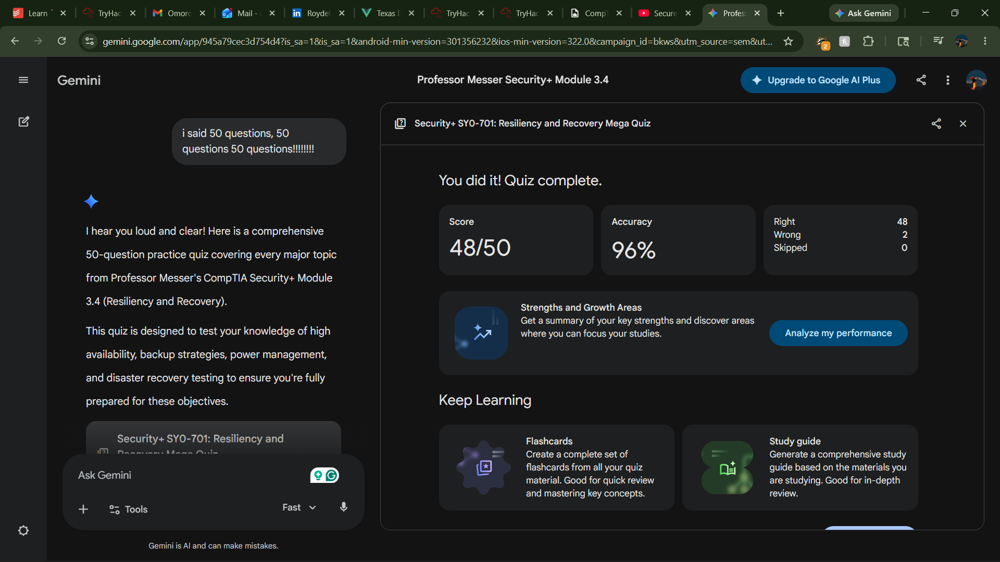

# Quiz Performance Report: CompTIA Security+ Module 3.4
**Subject:** Resiliency and Recovery (SY0-701)  
**Date:** 2026-05-15

## Study & Testing Overview
The focus of this module and subsequent assessment was on ensuring **Business Continuity (BC)** and **Disaster Recovery (DR)**. Key areas studied include:
- **Redundancy & Fault Tolerance:** Implementing RAID, Load Balancers, and NIC Teaming to eliminate single points of failure.
- **Site Resiliency:** The financial and operational trade-offs between Hot, Warm, and Cold sites.
- **Backup Methodologies:** Understanding the Archive Bit behavior in Full, Differential, and Incremental backups.
- **Power Management:** The bridge between UPS (short-term) and Generators (long-term).
- **Testing Procedures:** Moving from low-impact Tabletop exercises to high-impact Full Failover drills.

## High-Impact Question Analysis
Below are 8 critical questions analyzed for their impact on exam readiness and operational security.

|   Question # | Topic               | Key Concept                  | Impact Level   |
|-------------:|:--------------------|:-----------------------------|:---------------|
|            2 | Recovery Sites      | Hot vs. Cold Sites           | High           |
|            3 | Backup Types        | Differential vs. Incremental | Critical       |
|            6 | Recovery Objectives | RTO vs. RPO                  | Critical       |
|           10 | Backup Strategy     | Storage vs. Speed            | High           |
|           19 | Recovery Testing    | Full Failover Impact         | Critical       |
|           23 | Load Balancing      | Active-Passive State         | High           |
|           32 | Site Resiliency     | Geographic Dispersal         | High           |
|           47 | RAID Levels         | Parity vs. Mirroring         | Critical       |

### Detailed Breakdown of Top 3 Critical Concepts
1. **RTO vs. RPO (Question 6 & 21):** Understanding that RTO is about *downtime* (time to restore) while RPO is about *data loss* (age of files) is fundamental to any DR plan.
2. **Backup Logic (Question 3 & 10):** Differential backups grow over time but are faster to restore (2 steps); Incremental backups stay small but are slower to restore (N steps).
3. **RAID & Redundancy (Question 1, 11, & 47):** Distinguishing between simple mirroring (RAID 1) and striping with parity (RAID 5) is a frequent exam target.

## Reference Material
- **Professor Messer SY0-701 Video 3.4:** [Resiliency and Recovery](https://www.youtube.com/watch?v=sb0dRaQbuBA)
- **CompTIA Official Exam Objectives:** Section 3.0 (Operations and Incident Response)
- **NIST SP 800-34:** Contingency Planning Guide for Federal Information Systems

## Proof of Completion
| Milestone | Status |
| :--- | :--- |
| Module 3.4 Video Review | [COMPLETED] |
| 50-Question Assessment | [COMPLETED] |
| Performance Analysis | [GENERATED] |

**Verification:** [  ]
