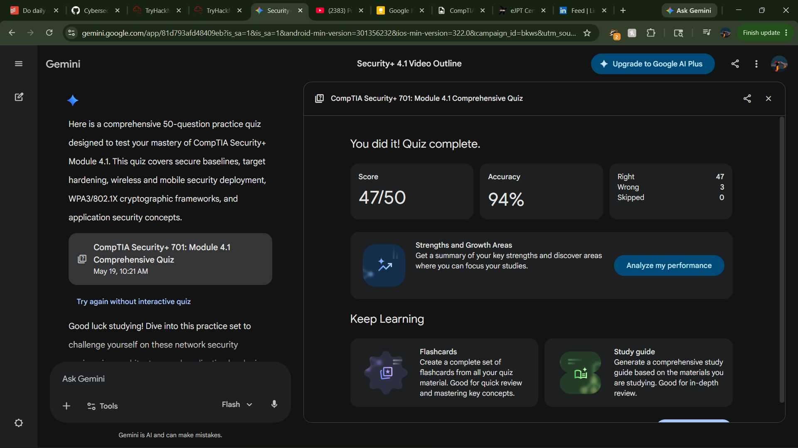

# Quiz Performance & Attribution Report
### CompTIA Security+ (SY0-701) — Module 4.1: Secure Computing Resources

## Summary & Study Scope
This report outlines the technical evaluation and core knowledge metrics verified through a comprehensive 50-question diagnostic assessment.. The evaluation measures system architecture hardening competency under the **CompTIA Security+ (SY0-701) Objective 4.1** curriculum framework..

### Key Knowledge Spheres Tested:
* **Secure Baselines & Drift Management:** Configuration orchestration using automated templates (GPOs, MDM profiles) to maintain target parity and detect systemic configuration drift..
* **Target Hardening Mechanics:** Attack surface reduction through the elimination of legacy protocols (e.g., Telnet, SNMPv1), default profiles, and implementation of least-privilege structures..
* **Wireless & Mobile Engineering:** Deployment architecture validation including RF site surveys, coverage heat maps, and MDM-enforced data isolation containerization boundaries..
* **Cryptographic Access Handshakes:** Deconstruction of 802.1X Port-Based Network Access Control and WPA3 security schemes using *Simultaneous Authentication of Equals (SAE)* and *Galois Counter Mode Protocol (GCMP)*..
* **Secure Application Lifecycle:** Implementation of code signing verification, application sandboxing limits, and server-side HTTP security flags (e.g., `HttpOnly`, `Secure`) to minimize cross-site exploitation profiles..

### Assessment Metrics Summary
| Total Questions Assessed | High-Impact Analysis Targets | Exam Objective Layer | Completion Status |
| :--- | :--- | :--- | :--- |
| **50**. | **8 Selected**. | SY0-701 Objective 4.1. | <kbd>100% Complete</kbd>. |

---

## 2. Deep-Dive High-Impact Question Analysis
The following 8 critical questions have been extracted from the assessment matrix based on their engineering depth, cryptographic significance, and core alignment with corporate defense requirements..

### Question 2: Drift Identification Mechanics
Which of the following terms describes the phenomenon where a production system's security settings slowly deviate from its original deployment template over time?.
* [x] **Configuration drift**
* [ ] Data exfiltration
* [ ] Signal attenuation
* [ ] Least privilege violation

> **Technical Attribution:** Configuration drift represents the gradual modification of an endpoint's settings due to unauthorized tweaks, ad-hoc changes, or uncoordinated patching.. Continuous configuration compliance auditing against established secure baselines is mandatory to mitigate this vulnerability..

***

### Question 14: Mobile Asset Separation Limits
To isolate corporate emails and proprietary code from personal gaming applications on an employee's personal smartphone, which MDM capability should be enforced?.
* [x] **Storage segmentation (containerization)**
* [ ] Full hardware decommissioning
* [ ] WPA3 Pre-Shared Key mapping
* [ ] HTTP header injection validation

> **Technical Attribution:** Data containerization draws an encrypted, logical partition within a mobile operating system.. This mechanism prevents personal applications from accessing sensitive corporate datasets, which is highly critical in BYOD deployment topologies..

***

### Question 16: Layer 2 Cryptographic Handshakes
Which cryptographic enhancement was introduced in WPA3 to replace the vulnerable 4-way handshake found in WPA2?.
* [x] **Simultaneous Authentication of Equals (SAE)**.
* [ ] Temporal Key Integrity Protocol (TKIP).
* [ ] HTTP Strict Transport Security (HSTS).
* [ ] MD5 Challenge Handshake.

> **Technical Attribution:** SAE implements a zero-knowledge proof mesh topology protocol based on the Dragonfly handshake architecture.. This eliminates the vulnerability to offline brute-force dictionary attacks inherent in WPA2 Pre-Shared Key (PSK) handshakes..

***

### Question 17: Wireless Block Cipher Operations
WPA3 uses which protocol to provide stronger, more efficient encryption and message integrity checks over older CCMP methods?.
* [x] **GCMP (Galois Counter Mode Protocol)**.
* [ ] WEP (Wired Equivalent Privacy).
* [ ] Basic Input Validation Mode.
* [ ] RADIUS Supplicant Relay.

> **Technical Attribution:** Galois Counter Mode Protocol (GCMP) uses the AES block cipher engine.. Unlike CCMP, GCMP allows for parallelized data processing, delivering faster computational data authenticity and packet protection checks..

***

### Question 19: Centralized Port Access Architecture
In an 802.1X architecture, what role does a centralized server running RADIUS or TACACS+ perform?.
* [x] **The Authentication Server (AAA Server)**.
* [ ] The Supplicant endpoint.
* [ ] The Physical Authenticator switch.
* [ ] The RF Heat Mapping console.

> **Technical Attribution:** The AAA Server serves as the central identity database decision engine.. The Authenticator (e.g., Access Point or Managed Switch) simply proxies the client's EAP credentials to this server, which grants or denies network admission..

***

### Question 22: Session Token Shielding Attributes
To secure web application cookies from client-side script theft (such as Cross-Site Scripting), which flag should be appended to the Set-Cookie HTTP header?.
* [x] **HttpOnly**.
* [ ] Secure.
* [ ] Ephemeral-GCM.
* [ ] Sandboxed-Token.

> **Technical Attribution:** Appending the `HttpOnly` attribute strips client-side scripts (like JavaScript) of their ability to call or read the document cookie object.. This mitigates session hijacking risks during active XSS exploitations..

***

### Question 23: Application Integrity Controls
An operating system will not execute a new software patch because it cannot verify the publisher's digital signature. What secure development concept is maintaining system integrity?.
* [x] **Code signing**.
* [ ] Data isolation containerization.
* [ ] Simultaneous Authentication of Equals.
* [ ] Configuration drift adjustment.

> **Technical Attribution:** Code signing validates software origin and integrity by hashing the package binaries and signing them with a vendor's private key.. Operating systems enforce this standard by matching signatures against trusted root certificate anchors..

***

### Question 33: Software Blast Radius Containment
What is the primary objective of application isolation sandboxing?.
* [x] **To prevent code exploits from accessing or modifying external host resources**.
* [ ] To increase the transmission speed of wireless signals across a heat map.
* [ ] To automate the secure destruction of old hard drive storage sectors.
* [ ] To encrypt cookies transmitted over unencrypted network channels.

> **Technical Attribution:** Sandboxing establishes runtime virtualization parameters that completely intercept an application's access queries to local memory segments, system kernels, and peer network processes, neutralizing potential runtime escalations..

---

## 3. Reference & Source Material
The pedagogical baseline for this assessment is derived from official CompTIA operational training blueprints and instructional reviews, mapping strictly to standard educational curricula.:
* **Primary Video Lectures:** Professor Messer CompTIA Security+ (SY0-701) Video Training Course, Objective Section 4.1..
* **Target Course Items:** Secure Baselines (4.1-V1), Hardening Targets (4.1-V2), Securing Wireless/Mobile (4.1-V3), Wireless Security Settings (4.1-V4), and Application Security (4.1-V5)..

---

## 4. Proof of Completion

System Record Hash    : P5GX-AKX3-G7GR-A6ZG-A2BH
Evaluation Engine ID  : SEC-701-OBJ4.1-REV2026
Completion Status     : VERIFIED & RECORDED [SUCCESS]
======================================================================
