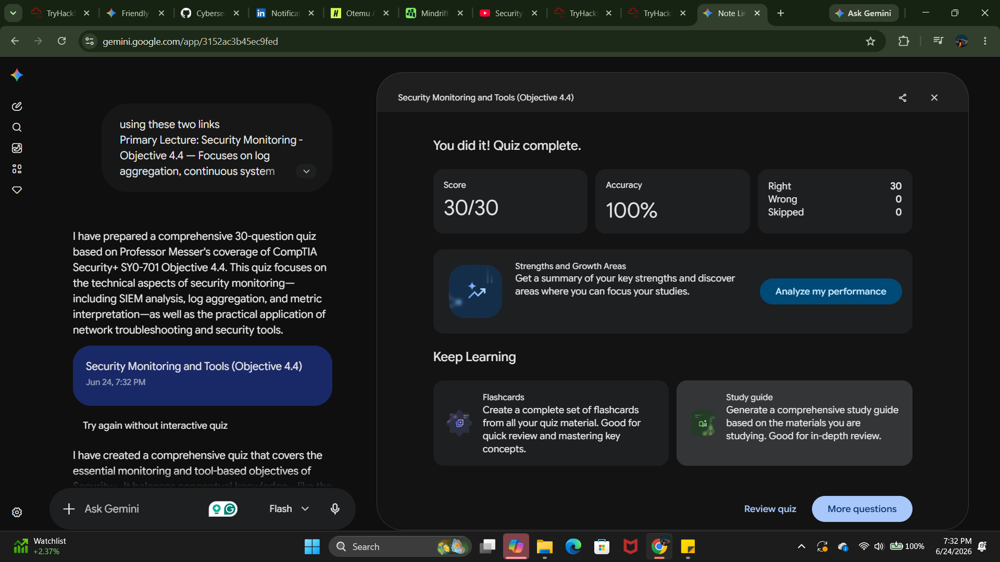
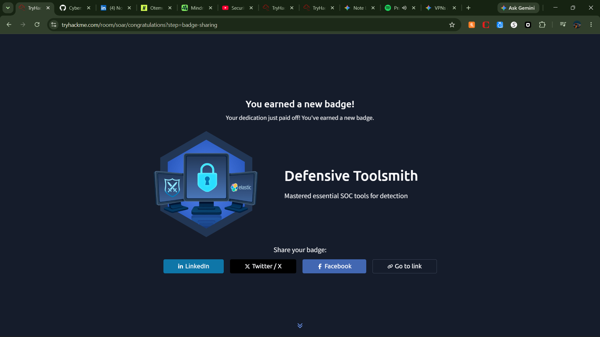

# CompTIA Security+ SY0-701 | Objective 4.4: Security Monitoring & Tools

### Objective Overview

* **Log Normalization & SIEM:** Centralizing disparate logs (firewalls, routers, servers) into a unified database schema for automated correlation and alerting.
* **Fidelity & Tuning:** Balancing detection logic to eliminate **false negatives** (missed attacks) and minimize **false positives** (benign noise).
* **Network & Asset Visibility:** Leveraging protocol analyzers (e.g., Wireshark) and continuous scanners to track volume anomalies, exfiltration spikes, and software drift.

---

### High-Impact Question Analysis

#### 1. SIEM Log Processing

A SIEM system transforms inconsistent data objects (Syslog, JSON, Windows Events) from diverse infrastructure hosts into a standard schema. What is this step?

* A) Log Aggregation
* **B) Log Normalization**
* C) Long-term Log Retention
* D) Ad-hoc Reporting

> **Analysis:** Normalization parses disparate formats into a unified database schema, enabling correlation engines to match cross-platform activity fields (e.g., matching a firewall IP block to an AD account login).

#### 2. Detection Gap Classification

An unthrottled password-spraying attack bypasses perimeter security systems entirely without generating alarms. How is this gap categorized?

* A) False Positive
* B) True Positive
* **C) False Negative**
* D) True Negative

> **Analysis:** A false negative occurs when malicious activity takes place but security controls fail to detect it. This represents a blind spot requiring signature or heuristic tuning.

#### 3. Data Exfiltration Monitoring

A server exhibits an automated dashboard alert at 02:00 UTC. Which metric provides the most actionable indication of data exfiltration?

* A) Elevated authentication errors
* **B) Network traffic volume anomalies**
* C) Local application crash rates
* D) Operating system version drift

> **Analysis:** Mass exfiltration fundamentally manifests as a massive, anomalous outbound volume spike compared to an established operational baseline.

#### 4. Containment Priority

A workstation is flagged for executing an active lateral scanning script inside a production VLAN. What is the immediate structural reaction required?

* A) Run an ad-hoc compliance report
* **B) Quarantine the system from the network**
* C) Back up local application logs
* D) Schedule an operating system patch window

> **Analysis:** Immediate network isolation or containment halts lateral pivot maneuvers and command-and-control ($C2$) communication vectors before secondary forensics begin.

#### 5. Long-Term Retention Drivers

An enterprise mandates a 7-year log retention policy for all boundary infrastructure assets. What is the primary operational driver?

* A) Real-time alerting processing speed
* **B) Deep forensic trend analysis and compliance**
* C) Minimizing local CPU utilization
* D) Eliminating false-positive alert metrics

> **Analysis:** Long-term preservation satisfies regulatory compliance (HIPAA, PCI-DSS) and allows retroactive historical investigation of advanced persistent threats (APTs).

#### 6. Endpoint Resource Monitoring

An analyst monitors identity metrics to detect credential misuse. Which pattern indicates immediate account compromise?

* **A) Concurrent sessions originating from different geographic regions**
* B) A user changing passwords within the standard policy window
* C) An active remote access session utilizing a corporate split tunnel
* D) A batch process executing a scheduled backup during off-peak hours

> **Analysis:** Known as "impossible travel," simultaneous logons from geographically disparate locations signal compromised credentials.

#### 7. Predictive Reporting Models

An administrator needs to know how many corporate endpoints will become vulnerable when a legacy OS reaches its end-of-life status next quarter. What report is used?

* A) Continuous vulnerability compliance report
* **B) Ad-hoc "what-if" analysis report**
* C) Real-time SIEM dashboard feed
* D) Low-fidelity false negative alert log

> **Analysis:** An ad-hoc "what-if" report isolates and models future variables against current asset inventories to predict structural vulnerability windows.

#### 8. Packet Forensics

An incident responder requires full visibility into raw network layer transmissions to reconstruct an unencrypted HTTP session. Which tool category must be leveraged?

* A) Log Aggregator
* **B) Protocol Analyzer / Packet Sniffer**
* C) Vulnerability Compliance Scanner
* D) Endpoint Resource Monitor

> **Analysis:** Protocol analyzers (e.g., Wireshark, Zeek) capture and decode raw frame traffic directly off the wire, exposing application-layer payloads.

---

### Reference Material

* [Video: Security Monitoring (4.4)](https://www.youtube.com/watch?v=np2WI_rM-Ok) | [Video: Security Tools (4.4)](https://www.youtube.com/watch?v=nNiNTviiacU)

---

### Proof of Completion

