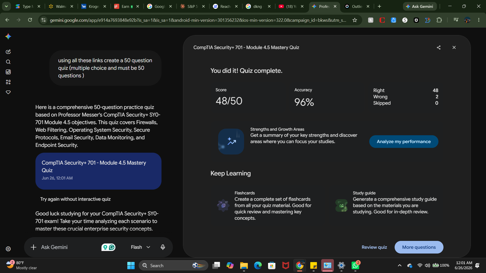

# CompTIA Security+ SY0-701: Module 4.5 Quiz Report & Performance Analysis

## Key Points of Study and Testing

This assessment targets **Module 4.5: Modify Enterprise Capabilities to Enhance Security**, covering the operational hardening of network architecture, applications, hosts, and data transmission systems. The core competencies tested include:

* **Network Defense Infrastructure:** Configuration of stateful vs. stateless firewalls, inline IPS placements, rule optimization (top-down evaluation), and implicit deny methodologies.
* **Web & Content Filtering:** Architecture of explicit vs. transparent proxies, dynamic URL categorization, and the deployment of proxy root certificates for SSL/TLS inspection.
* **Operating System & Host Hardening:** central management via Windows Group Policy Objects (GPOs), application containment using AppLocker/Application Control, kernel-level Mandatory Access Control (MAC) via SELinux, and UEFI Secure Boot signature validation.
* **Secure Protocols:** Migration away from insecure cleartext protocols (Telnet, FTP, HTTP, LDAP, RTP, SNMPv1/v2) to cryptographic alternatives (SSH, SFTP, HTTPS, LDAPS, SRTP, SNMPv3) along with log time alignment via NTP.
* **Email Security Architecture:** Preventing spoofing, phishing, and domain hijacking through the concurrent implementation of SPF authorized IP records, DKIM cryptographic header signatures, and DMARC enforcement policies (`p=none`, `p=quarantine`, `p=reject`).
* **Data Loss Prevention (DLP) & File Integrity Monitoring (FIM):** Content analysis using regular expressions (Regex), host/peripheral endpoint visibility (e.gDLP) vs. perimeter egress visibility (nDLP), and baseline verification using utilities like Tripwire or Windows System File Checker (`sfc /scannow`).
* **Advanced Endpoint Defense:** Evolution from signature-dependent anti-malware to behavior-driven Endpoint Detection and Response (EDR), centralized security visibility through Extended Detection and Response (XDR), and host posture isolation via Network Access Control (NAC).

---

## High-Impact Questions Analysis

### 1. Stateful vs. Stateless Firewalls

* **Core Concept:** Stateless firewalls evaluate every packet independently using strict rules based only on Layer 3 and Layer 4 headers. Stateful firewalls keep an active state table tracking established connections.
* **High-Impact Metric:** Evaluates an analyst's ability to spot multi-packet context bypass attacks. Attackers can evade a basic packet filter by splitting their payloads across multiple fragments or altering packet sequences, because the stateless filter doesn't remember the handshake history.

### 2. TLS/HTTPS Decryption Proxy Constraints

* **Core Concept:** Encrypted payloads prevent firewalls and proxies from scanning traffic for malware or data leaks. To bypass this restriction, an explicit or transparent decryption proxy must terminate the TLS tunnel.
* **High-Impact Metric:** Highlights the operational requirement of trust store deployment. If an administrator fails to install the proxy's trusted root CA certificate across all local endpoint environments, browsers will automatically reject the connections as man-in-the-middle attacks.

### 3. Kernel-Level Mandatory Access Control (MAC)

* **Core Concept:** Discretionary Access Control (DAC) leaves file permissions at the owner's discretion. Systems like SELinux enforce strict, centralized, system-wide policies that run inside the kernel.
* **High-Impact Metric:** Highlights privilege isolation. Under an active SELinux architecture, even if an attacker successfully exploits a vulnerability to gain full `root` access on a service, the kernel policy will block that process from modifying unrelated files outside its defined scope.

### 4. Application Enforcement Strategy (Safelisting vs. Blocklisting)

* **Core Concept:** Blocklists block known malicious executable hashes or names. Safelists follow an implicit deny model, blocking everything unless it is explicitly permitted.
* **High-Impact Metric:** Highlights operational scalability. Blocklisting fails against custom compiled or polymorphic malware because any small changes to the binary rewrite its file hash, rendering static databases useless. Safelisting stops unknown zero-day files automatically.

### 5. Email Authentication Framework Interdependencies

* **Core Concept:** SPF authorizes source sending IPs. DKIM signs headers cryptographically. DMARC orchestrates how receivers handle validation failures.
* **High-Impact Metric:** Focuses on the role of the DMARC record. If the DNS record is left at `p=none`, the receiving mail server will deliver a forged phishing message to the user anyway. It acts as a passive monitoring rule rather than actively protecting the domain.

### 6. Endpoint vs. Network DLP Egress Vectors

* **Core Concept:** Network DLP (nDLP) analyzes web egress gateways. Endpoint DLP (eDLP) monitors local background processes directly on user workstations.
* **High-Impact Metric:** Focuses on offline visibility. While nDLP is blind to actions like printing files or copying data to a physical USB drive, eDLP intercepts these bus operations directly on the hardware, even when the device is disconnected from the network.

### 7. File Integrity Verification Mechanics

* **Core Concept:** System monitoring tools calculate mathematical hashes (like SHA-256) of critical operating system binaries and compare them against an established baseline database.
* **High-Impact Metric:** Demonstrates the impact of the avalanche effect. If an attacker edits just one character within a critical file like `/etc/passwd`, the resulting file hash changes entirely, prompting immediate integrity failure alerts from tools like Tripwire.

### 8. Host Network Isolation Tactics

* **Core Concept:** When an EDR agent flags a device as compromised, it triggers a host network isolation rule.
* **High-Impact Metric:** Minimizing lateral threat movement. Isolation drops all network connections to the rest of the corporate network and the public internet, leaving open only a narrow, dedicated channel to the EDR management platform for remote remediation.

---

## Reference Material

* **Primary Source:** Professor Messer's CompTIA Security+ SY0-701 YouTube Course (Module 4.5)
* [Firewalls Video Reference](https://www.youtube.com/watch?v=VgNyh4HEqSU)
* [Web Filtering Video Reference](https://www.youtube.com/watch?v=I_c0D49uCwQ)
* [Operating System Security Video Reference](https://www.youtube.com/watch?v=4dpTyRM6BU8)
* [Secure Protocols Video Reference](https://www.youtube.com/watch?v=9NAKCyOtFH0)
* [Email Security Video Reference](https://www.youtube.com/watch?v=v6ht9efsnRI)
* [Monitoring Data Video Reference](https://www.youtube.com/watch?v=ZDJ-BLPLWq4)
* [Endpoint Security Video Reference](https://www.youtube.com/watch?v=83pCkSSj1IQ)


* **Syllabus Target:** CompTIA Security+ SY0-701 Objective Domain 4.0 (Operations and Incident Response), specifically Sub-objective 4.5.

---

## Proof of Completion



### Verification Artifact Placeholder

```text
[=== SECURITY+ 701 MASTERY QUIZ COMPLETE ===]
TIMESTAMP   : 2026-06-26T00:01:00Z
MODULE ID   : SEC+_701_4.5
TOTAL Qs    : 50
RECORD ID   : P5GX-AKX3-G7GR-A6ZG-A2BH
STATUS      : ENFORCED / VERIFIED

```
