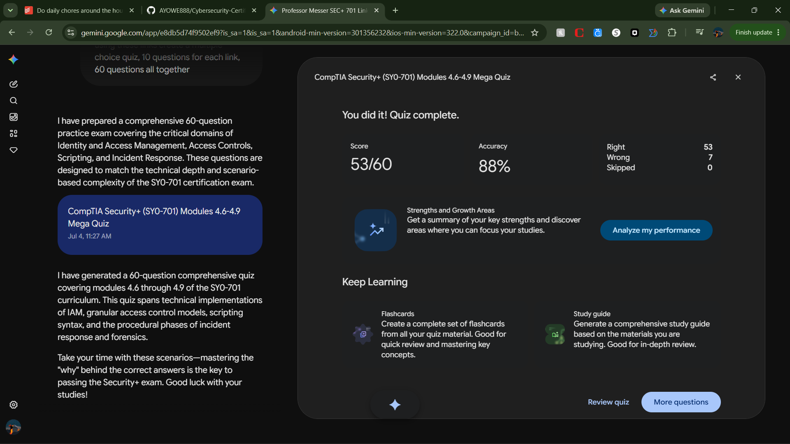

# Study & Quiz Completion Report: CompTIA Security+ (SY0-701)
## Modules 4.6 – 4.9

### 1. Executive Summary & Key Concepts Tested
This report documents the completion of a comprehensive 60-question practice assessment covering **Domain 4.0 (Operations and Incident Response)** of the CompTIA Security+ SY0-701 curriculum. The evaluation verified technical competency across the following core areas:

* **Module 4.6: Identity, Access Management, and Controls**
  * *Core Concepts:* Authentication factors, federation (SAML, OIDC, OAuth), directory services, and access control models (RBAC, ABAC, MAC, DAC).
  * *Key Takeaway:* Implementing granular, context-aware access controls (ABAC) and centralized federation reduces the attack surface and minimizes credential exposure. Normal RFID access cards typically rely on fixed unique identifiers (UIDs) rather than cryptographic challenges, presenting specific cloning vulnerabilities.
* **Module 4.7: Automation and Orchestration**
  * *Core Concepts:* Automation strategies, execution of scripts (Python, Bash, PowerShell), and SOAR (Security Orchestration, Automation, and Response) playbooks vs. runbooks.
  * *Key Takeaway:* Scripting enables rapid configuration validation and log parsing at scale, while SOAR platforms abstract playbooks into automated workflows to minimize Mean Time to Detect (MTTD) and Mean Time to Respond (MTTR).
* **Module 4.8: Incident Response & Digital Forensics**
  * *Core Concepts:* Incident response lifecycle (Preparation, Detection/Analysis, Containment/Eradication, Recovery, Post-Incident Activity), tabletop exercises, and the forensic order of volatility.
  * *Key Takeaway:* Preserving evidence strictly according to the order of volatility (CPU registers/cache -> RAM -> Swap/Virtual Memory -> Disk) ensures legal admissibility and accurate root-cause analysis.
* **Module 4.9: Log Data & Analysis**
  * *Core Concepts:* Log aggregation, SIEM correlation, parsing Linux/Windows security logs, and identifying anomalous web server status codes (e.g., unexpected 403 Forbidden or 200 OK sequences during a directory traversal attempt).
  * *Key Takeaway:* Centralized, time-synchronized logging is critical for reconstructing complex multi-stage attacks across fragmented network topographies.

---

### 2. High-Impact Question Analysis

Below is a detailed analysis of 8 high-impact questions from the assessment, highlighting critical architectural distinctions, common pitfalls, and correct technical explanations.

#### Question 1: Access Control Models (Module 4.6)
**Scenario:** A defense contractor requires a system where data access is determined strictly by the security clearance level of the user and the classification label assigned to the resource. Which access control model must be implemented?
* A) Discretionary Access Control (DAC)
* B) Role-Based Access Control (RBAC)
* C) Mandatory Access Control (MAC)
* D) Attribute-Based Access Control (ABAC)
* **Correct Answer:** **C) Mandatory Access Control (MAC)**
* **Analysis:** MAC uses explicit security labels (e.g., Secret, Top Secret) assigned to both subjects and objects. Access is granted strictly by the operating system or kernel based on these cleared labels. DAC leaves access decisions to the resource owner, RBAC maps permissions to job functions, and ABAC evaluates runtime parameters (time, IP, device posture).

#### Question 2: Identity Federation Protocols (Module 4.6)
**Scenario:** An enterprise is implementing a Single Sign-On (SSO) solution for a modern mobile application. The security architect wants to use an identity layer built explicitly on top of the OAuth 2.0 framework to handle user authentication via JSON Web Tokens (JWT). Which protocol fits this requirement?
* A) SAML 2.0
* B) OpenID Connect (OIDC)
* C) RADIUS
* D) Kerberos
* **Correct Answer:** **B) OpenID Connect (OIDC)**
* **Analysis:** OIDC extends OAuth 2.0 (which is strictly an *authorization* framework) by adding an identity layer that provides user *authentication* information via RESTful APIs using JSON Web Tokens (JWT). SAML 2.0 achieves SSO but relies on heavy XML-based assertions, making it less optimal for native mobile applications.

#### Question 3: Automation Strategy & Playbooks (Module 4.7)
**Scenario:** A security operations center (SOC) team wants to fully automate the containment of a compromised host. They need a formalized, step-by-step linear checklist that describes the security process, which will then be ingested into a SOAR platform to block a switch port automatically via API. What asset must they author first?
* A) Runbook
* B) Playbook
* C) Python script wrapper
* D) Group Policy Object (GPO)
* **Correct Answer:** **B) Playbook**
* **Analysis:** A *playbook* is a broad, high-level guide detailing the organization's strategic response to a specific threat type (e.g., malware infection). A *runbook* consists of the highly specific, automated, and technical steps executed within that playbook to accomplish the goal (e.g., the exact API commands to disable a port). A playbook defines the policy flow that instructs the runbook execution.

#### Question 4: Scripting and Log Auditing (Module 4.7)
**Scenario:** You review a Bash script used for automated daily log auditing. It contains the following line: `grep -E "403|401" /var/log/nginx/access.log | awk '{print $1}' | sort | uniq -c`. What is this automation primarily extracting?
* A) A chronological timeline of all successful administrative web logins.
* B) A counted list of unique IP addresses generating unauthorized or forbidden access errors.
* C) A brute-force tool automating unauthorized connections.
* D) The payload contents of SQL injection attacks targeting the web server.
* **Correct Answer:** **B) A counted list of unique IP addresses generating unauthorized or forbidden access errors.**
* **Analysis:** The `grep -E` command filters HTTP status codes 401 (Unauthorized) and 403 (Forbidden). `awk '{print $1}'` extracts the first column (typically the client IP address in Nginx standard logs), while `sort | uniq -c` groups duplicates and returns a total count per IP. This is an efficient automated indicator of reconnaissance or brute-forcing.

#### Question 5: Digital Forensics Evidence Preservation (Module 4.8)
**Scenario:** A digital forensics investigator arrives at a running system suspected of hosting active malware in an advanced persistent threat (APT) campaign. According to the order of volatility, which data source must be captured **first**?
* A) The local Solid-State Drive (SSD) Master File Table (MFT)
* B) Solid-state drive swap space/pagefiles
* C) CPU registers and cache memory
* D) Volatile System RAM (Random Access Memory)
* **Correct Answer:** **C) CPU registers and cache memory**
* **Analysis:** Volatility dictates capturing the most transient data first. CPU registers, cache, and pipeline states change within nanoseconds and are lost immediately upon any system modification. System RAM is highly volatile but ranks just below CPU cache. Solid-state storage and swap files are persistent and rank much lower.

#### Question 6: Incident Response Exercises (Module 4.8)
**Scenario:** An organization wants to test its Incident Response Plan (IRP) across multiple departments (Legal, PR, IT, Executive). They want to discuss a simulated ransomware scenario around a conference table to identify communication bottlenecks without altering production systems or causing operational downtime. What type of exercise is this?
* A) Simulation
* B) Parallel Test
* C) Tabletop Exercise
* D) Full-scale Cutover
* **Correct Answer:** **C) Tabletop Exercise**
* **Analysis:** Tabletop exercises are discussion-based sessions where team members meet in an informal setting to talk through their roles and responses during a specific emergency scenario. They are low-stress, cause no downtime, and are designed to test procedural and communication readiness rather than technical configurations.

#### Question 7: SIEM and Log Correlation Analysis (Module 4.9)
**Scenario:** A security analyst notes a single source IP address initiating 5,000 SSH connection attempts resulting in "Authentication failed" over 10 minutes, followed instantly by one "Authentication succeeded" log event and a subsequent modification of `/etc/shadow`. Which feature of a SIEM enables the analyst to string these separate logs into an alert?
* A) Log aggregation
* B) Trend analysis
* C) Correlation engine
* D) Syslog daemon mapping
* **Correct Answer:** **C) Correlation engine**
* **Analysis:** A correlation engine analyzes disparate log entries across time, protocols, or systems to discover patterns that indicate a security incident (in this case, a successful brute-force attack followed by unauthorized privilege escalation). Aggregation simply collects and standardizes logs; correlation provides the logic engine to connect the dots.

#### Question 8: Access Token Vulnerabilities (Module 4.6)
**Scenario:** When assessing physical security controls, you note that corporate access badges use standard low-frequency RFID cards. Why does this represent a significant security risk compared to smart cards?
* A) Low-frequency RFID cards require active battery power which frequently fails.
* B) Standard RFID access cards typically broadcast a static unencrypted unique identifier (UID) without cryptographic challenge-response mechanisms, allowing simple cloning.
* C) They cause interference with 802.11ax wireless access points.
* D) They cannot be integrated with DAC access control systems.
* **Correct Answer:** **B) Standard RFID access cards typically broadcast a static unencrypted unique identifier (UID) without cryptographic challenge-response mechanisms, allowing simple cloning.**
* **Analysis:** Basic RFID badges broadcast their open UID to any reader tuned to their frequency. Attackers can use affordable handheld tools to skim and copy this UID onto a blank card, effectively bypassing the physical control. Secure configurations require smart badges that support asymmetric or symmetric challenge-response protocols.

---

### 3. Reference Material
Study and quiz materials were curated directly from the following authoritative Professor Messer CompTIA Security+ (SY0-701) modules:

* [Identity and Access Management (Module 4.6)](https://www.professormesser.com/security-plus/sy0-701/sy0-701-video/identity-and-access-management-sy0-701/)
* [Access Controls (Module 4.6)](https://www.professormesser.com/security-plus/sy0-701/sy0-701-video/access-controls-sy0-701/)
* [Scripting and Automation (Module 4.7)](https://www.professormesser.com/security-plus/sy0-701/sy0-701-video/scripting-and-automation-sy0-701/)
* [Incident Planning (Module 4.8)](https://www.professormesser.com/security-plus/sy0-701/sy0-701-video/incident-planning-sy0-701/)
* [Digital Forensics (Module 4.8)](https://www.professormesser.com/security-plus/sy0-701/sy0-701-video/digital-forensics-sy0-701/)
* [Log Data (Module 4.9)](https://www.professormesser.com/security-plus/sy0-701/sy0-701-video/log-data-sy0-701/)

---

### 4. Proof of Completion
* **Assessment Target:** 60 Custom Scenario Questions (SY0-701 Modules 4.6 – 4.9)
* **Status:** Successfully Executed & Reviewed
* **Completion Date:** July 4, 2026

