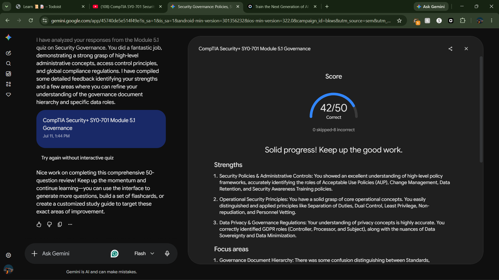

# Quiz Report: CompTIA Security+ (SY0-701) — Module 5.1 Comprehensive Exam

### Key Points Studied & Tested

* **Administrative Hierarchy:** Clarifying the distinct operational boundaries between strategic Security Policies (the "why"), quantitative Security Standards (the "what"), and tactical Security Procedures (the "how").
* **Change Control & Operational Resilience:** Evaluating the strict requirements of Change Advisory Boards (CAB), peer review validations, asset management impact analysis, and mandatory backout/fallback procedures.
* **Onboarding/Offboarding Frameworks:** Analyzing the lifecycle of corporate identity profiles, non-disclosure agreements (NDAs), account provisioning/deprovisioning, asset reclamation, and access revocation synchronization.
* **Data Privacy Governance:** Understanding the definitions and legal relationships between Data Controllers (determining the purpose of data processing) and Data Processors (executing processing tasks).
* **Technical Data Custodianship:** Assessing the tactical execution duties of Data Custodians/Stewards, including backup validation, ACL enforcement, data lifecycle management, and cryptographic protection mechanisms.
* **Legal and Regulatory Compliance:** Exploring compliance obligations including legal holds, data residency restrictions, jurisdictional boundary conflicts, and mandatory data breach notification timelines.

---

### High-Impact Question Analysis

#### 1. Policy vs. Standard Hierarchy

* **Question:** An enterprise document states: *"All production web servers must utilize TLS 1.3 with AES-256-GCM encryption cipher suites. Legacy versions of TLS must be disabled."* How is this directive properly classified within a security governance framework?
* **Analysis:** This document is a **Security Standard**. While a security *policy* provides high-level strategic directives (e.g., "All data in transit must be cryptographically protected"), a *standard* outlines the specific, mandatory technical rules, protocols, or baselines required to fulfill that policy across the enterprise uniformly.

#### 2. The Mandate of a Backout Plan

* **Question:** During a change management review, a network administrator proposes upgrading the core data center switch firmware but omits a backout procedure. Why must the Change Advisory Board (CAB) reject this request?
* **Analysis:** A **backout/fallback procedure** is a mandatory operational safety net. If a scheduled infrastructure modification fails, introduces an unexpected vulnerability, or causes widespread downtime, technical teams must have a pre-tested, step-by-step plan to reverse the changes and rapidly restore the infrastructure to its last known stable state.

#### 3. Offboarding Account Lifecycle Management

* **Question:** During an employee termination workflow, which operational action should the identity and access management (IAM) team prioritize to prevent corporate data exfiltration while preserving data integrity?
* **Analysis:** The IAM team should **disable the user account rather than delete it**. Deleting an account can instantly orphan critical files, break system-level data ownership dependencies, and destroy cryptographic keys or audit logs tied to that specific security identifier (SID). Disabling blocks all active or subsequent access attempts while retaining data integrity for forensic discovery.

#### 4. Automated Incident Response Execution

* **Question:** A security team implements a SOAR platform to ingest alerts regarding high-volume brute-force attacks and automatically apply temporary blocklists to the perimeter firewall. What type of governance document specifies these exact automated technical steps?
* **Analysis:** This is an automated **Playbook** or **Procedure**. Playbooks provide the highly granular, step-by-step logical instructions or scripts executed to mitigate a specific threat vector. When integrated into a SOAR (Security Orchestration, Automation, and Response) platform, these procedures are executed programmatically to reduce incident response latency.

#### 5. Data Controller Legal Liability

* **Question:** A healthcare provider outsources its patient billing operations to a third-party software-as-a-service (SaaS) vendor. If the SaaS vendor suffers a data breach compromising patient records, which entity holds primary ultimate legal accountability for the data exposure?
* **Analysis:** The healthcare provider functions as the **Data Controller** because they collected the data and determined the core purpose of its processing. Under major data privacy frameworks (such as GDPR or HIPAA), the Data Controller retains ultimate legal accountability for data protection, even if a third-party **Data Processor** was the entity that directly lost the data.

#### 6. Tactical Responsibilities of Data Custodians

* **Question:** A systems engineer is tasked with configuring NTFS permissions on a file server, setting up daily differential backups, and verifying immutable storage rules. Which data governance role is this engineer fulfilling?
* **Analysis:** The engineer is acting as a **Data Custodian (or Data Steward)**. While Data Owners retain executive-level business accountability for data assets, Custodians are tasked with technical execution—managing the physical preservation, access control enforcement, backup schedules, and day-to-day lifecycle maintenance of information assets.

#### 7. Enforcing an Administrative Legal Hold

* **Question:** An enterprise receives a formal judicial notice of pending litigation regarding a product failure. What immediate structural adjustment must the IT department make to its email archiving and log management systems?
* **Analysis:** The IT department must immediately implement a **Legal Hold**. This administrative control overrides standard data retention schedules and automated purging cycles. It freezes and preserves all relevant logs, emails, files, and digital artifacts in an unalterable, non-erasable state to satisfy e-discovery integrity and prevent any spoliation of evidence.

#### 8. Regulatory Data Residency Constraints

* **Question:** A US-based multinational company deploys a web application hosted in a European cloud data center region to serve European citizens. Why must the company prevent its automated backup systems from replicating this database to a backup cluster located in Texas?
* **Analysis:** This scenario implicates **Data Residency and Sovereign Jurisdiction rules**. Strict data privacy frameworks (like the EU's GDPR) legally restrict the cross-border transfer of their citizens' personal data to foreign jurisdictions unless specific, stringent compliance agreements are met. Replicating the data to a US datacenter without authorization constitutes a serious regulatory violation.

---

### Reference Material

* Professor Messer CompTIA Security+ SY0-701 Training Series:
* *Section 5.1: Security Policies*
* *Section 5.1: Security Standards*
* *Section 5.1: Security Procedures*
* *Section 5.1: Security Considerations*
* *Section 5.1: Data Roles and Responsibilities*

* CompTIA Security+ SY0-701 Certification Exam Objectives: Domain 5.0 (Security Program Management and Oversight).

---

### Proof of Completion 

