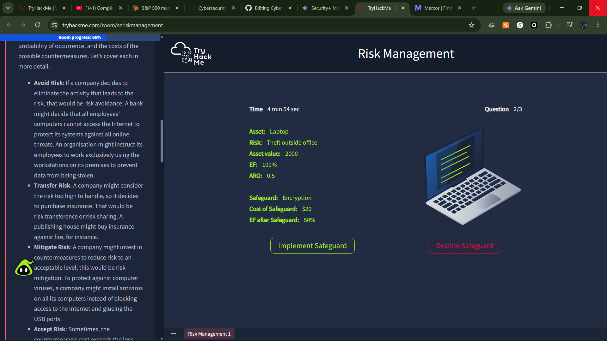
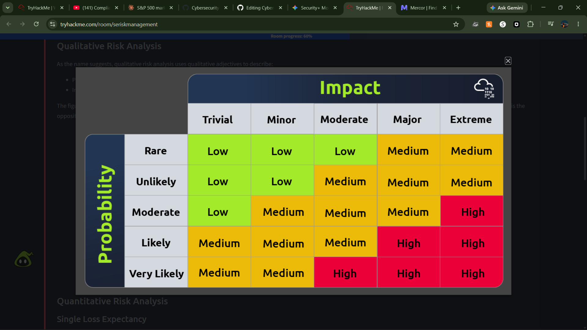

### Quiz Performance Report: Professor Messer Security+ (SY0-701) Module 5.2

#### 1. Summary

---

#### 2. Core Concepts Tested & Studied

This module and quiz evaluated your proficiency across three primary pillars of Domain 5 (Risk Management) for the Security+ SY0-701 exam:

* **Risk Management Strategies:** Identification, analysis, ownership, and response tracking (Mitigation, Avoidance, Transference, Acceptance) of internal, external, and environmental vulnerabilities.
* **Business Impact Analysis (BIA):** Prioritizing mission-essential functions, identifying critical system dependencies, and establishing strict operational recovery thresholds.
* **Risk Analysis & Reliability Metrics:** Quantifying financial impact ($SLE$, $ALE$, $ARO$), analyzing privacy safeguards ($PIA$, $PTA$), and calculating system reliability/availability ($MTBF$, $MTTF$, $MTTR$, $WRT$, $MTD$).

---

#### 3. High-Impact Question Analysis

The following 8 high-impact questions highlight critical exam objectives, exposing key conceptual differentiators and calculation variables.

##### Question 1: System Reliability vs. Maintenance Metrics (Non-Repairable)

* **Question:** A technician is evaluating the reliability of a new server cluster. Which metric should they use to predict the average time until a non-repairable component fails completely?
* **Correct Answer:** `MTTF` (Mean Time to Failure)
* **Analysis & Key Point:** For **non-repairable** items (like a single solid-state drive or capacitor), the component cannot be fixed; it must be replaced. Therefore, the metric tracking its total life expectancy is Mean Time to Failure (`MTTF`). `MTTR` measures service restoration speed rather than longevity.

##### Question 2: Hardware Reliability Differentiators

* **Question:** What is the primary difference between MTBF and MTTF?
* **Correct Answer:** `MTBF is for repairable items; MTTF is for non-repairable`
* **Analysis & Key Point:** Both metrics are strictly quantitative calculations. The defining boundary is *serviceability*. Mean Time Between Failures (`MTBF`) calculates the predicted time between failures for systems you **can repair** (e.g., a server chassis where you can swap power supplies). `MTTF` is reserved for components that are thrown away upon failure.

##### Question 3: Component Replacement & Recovery Windows

* **Question:** A technician replaces a failed hard drive in a RAID array. The total time from the drive failure to the RAID being fully rebuilt was 4 hours. Which metric does this 4-hour window represent?
* **Correct Answer:** `MTTR` (Mean Time to Repair)
* **Analysis & Key Point:** The elapsed time from the initial point of failure through troubleshooting, physical disk replacement, and background array rebuilding represents the total **Mean Time to Repair (`MTTR`)**. `MTBF` represents the time elapsed between distinct operational failures rather than the active repair window.

##### Question 4: Disruption Timelines vs. Business Survival Limits

* **Question:** An organization is performing a BIA. They find that the payroll system must be recovered within 24 hours to avoid legal issues. What is this 24-hour window called?
* **Correct Answer:** `MTD` (Maximum Tolerable Downtime)
* **Analysis & Key Point:** When mapping business survival limits to avoid systemic, financial, or legal collapse, you are defining the **Maximum Tolerable Downtime (`MTD`)** (also referred to as Maximum Allowable Downtime/MAD). `MTTR` is a purely technical metric for component maintenance rather than an organizational threshold.

##### Question 5: Algebraic Isolations in Quantitative Formulas

* **Question:** If an organization has an $SLE$ of $\$1,000$ and an $ALE$ of $\$10,000$, how many times per year is the event expected to occur ($ARO$)?
* **Correct Answer:** `10`
* **Analysis & Key Point:** The standard formula is:

$$ALE = SLE \times ARO$$


To isolate the Annualized Rate of Occurrence ($ARO$), the equation is reconfigured to:

$$ARO = \frac{ALE}{SLE}$$


Plugging in the parameters: $\$10,000 / \$1,000 = 10$ times per year. An $ARO$ of $0.1$ would indicate an event happening only once every 10 years.

##### Question 6: Screening vs. Assessing Privacy Lifecycles

* **Question:** A project manager is asked to conduct a preliminary survey to see if a new marketing database will store enough sensitive data to require a full Privacy Impact Assessment. What is this survey called?
* **Correct Answer:** `PTA` (Privacy Threshold Assessment)
* **Analysis & Key Point:** The initial *questionnaire/survey* used to verify if a system handles PII at all is a **Privacy Threshold Assessment (`PTA`)**. If the PTA comes back positive, it triggers the comprehensive **Privacy Impact Assessment (`PIA`)**. Data Loss Prevention (`DLP`) is an active technical security control, not an assessment framework.

##### Question 7: Administrative Controls and Risk Strategies

* **Question:** A company requires all employees to attend annual security awareness training. This is an example of which risk strategy?
* **Correct Answer:** `Risk Mitigation`
* **Analysis & Key Point:** Implementing training does not remove the risk vector completely; instead, it deploys an administrative control to lower the overall likelihood and impact of human error, which constitutes **Risk Mitigation**. Risk Avoidance requires completely stopping the high-risk activity (e.g., shutting down a service or banning external storage devices).

##### Question 8: Risk Terminology and Exceptions

* **Question:** An administrator identifies a vulnerability in a legacy system but determines that the cost of the fix exceeds the potential loss. The company decides to take no further action. What is this called?
* **Correct Answer:** `Risk Acceptance`
* **Analysis & Key Point:** The fundamental risk management strategy applied when choosing to absorb the potential loss without implementing active technical or administrative controls is **Risk Acceptance**. While an organization might document this decision within an "exception log," the underlying strategy is acceptance.

---

#### 4. Reference Material

To cement these metrics and eliminate any remaining confusion before exam day, review the core documentation guidelines and standard specifications:

* **NIST SP 800-30 Rev. 1:** *Guide for Conducting Risk Assessments* (Deals with qualitative/quantitative threats, impacts, and risk matrix formatting).
* **ISO/IEC 27005:** *Information security, cybersecurity and privacy protection — Guidance on managing information security risks*.
* **NIST SP 800-34 Rev. 1:** *Contingency Planning Guide for Federal Information Systems* (Provides detailed breakdowns of BIA development, mapping $RTO$, $RPO$, $WRT$, and $MTD$ dependencies).

---

#### 5. Proof of Completion



====================================================================

```
