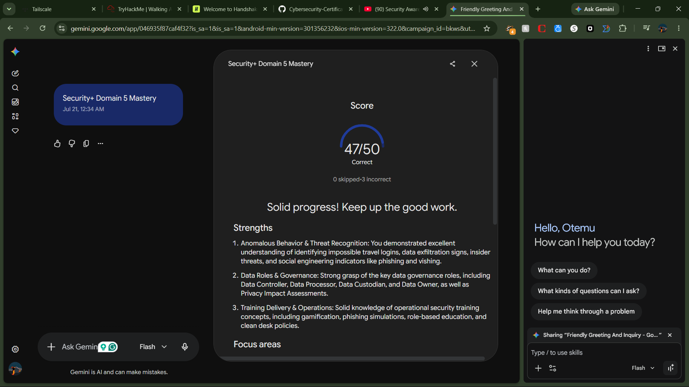

# Security+ SY0-701 Practice Quiz Report

---

## Executive Summary

* **Domains Studied & Tested:** Domain 5 (*Security Program Management and Oversight*) — specifically Subdomains **5.4 (Security Compliance & Privacy)** and **5.6 (Security Awareness & Training)**.
* **Core Concepts Tested:** GDPR roles/principles (Data Controller, Processor, Custodian, Data Subject), privacy impact assessments, training methodologies (Phishing Simulations, Gamification, Role-Based), social engineering indicators, and anomalous behavior detection (Impossible Travel, host file modifications, data exfiltration).

---

## Performance Breakdown

* **Total Questions:** 50
* **Score:** 47 / 50 (94%)
* **Completion Status:** Completed & Passed

### **Key Strengths**

* **Social Engineering & Training Methodologies:** Perfect identification of phishing indicators, vishing, tailgating, gamification, and role-based training scenarios.
* **Anomalous Behavior & Threat Detection:** Strong grasp of technical and operational indicators, including impossible travel velocity, outbound traffic spikes, and unauthorized host file modifications.
* **Data Roles:** Clear understanding of responsibilities for Data Owners, Controllers, Processors, and Custodians.

### **Areas for Improvement**

* **GDPR Rights vs. Technical Principles:** Nuancing specific data subject rights (e.g., *Right of Access* vs. *Right to Data Portability*) and fundamental principles (e.g., *Storage Limitation* as a retention mandate rather than a technical database size cap).

---

## High-Impact Question Analysis

### **1. GDPR Rights (Question 8)**

> **Question:** Under GDPR, what right ensures individuals can obtain a copy of their data in a commonly used, machine-readable format?
> **Correct Answer:** Right to data portability
> **Analysis:** The *Right of Access* allows individuals to confirm if their data is processed and view it. The *Right to Data Portability* specifically mandates providing that data in a structured, commonly used, machine-readable format so it can be transferred to another service.

---

### **2. GDPR Principles (Question 43)**

> **Question:** What does 'Storage Limitation' in GDPR dictate?
> **Correct Answer:** Delete data when no longer needed
> **Analysis:** *Storage Limitation* is a temporal retention policy, not a technical disk quota. It mandates that personal data must be erased or anonymized once it is no longer needed for its original processing purpose.

---

### **3. Training Methodologies (Question 16)**

> **Question:** What is the primary benefit of Computer-Based Training (CBT) compared to instructor-led training?
> **Correct Answer:** Consistency of delivery
> **Analysis:** CBT guarantees that every user across an organization receives the exact same standard curriculum and message regardless of location, schedule, or instructor variation.

---

### **4. Data Roles (Question 5)**

> **Question:** Which entity typically provides the underlying infrastructure (like a database or cloud platform) for data processing?
> **Correct Answer:** Data Processor
> **Analysis:** Third-party cloud service providers or platform vendors operating execution environments act as Data Processors under the direction of the Data Controller.

---

### **5. Anomalous Behavior (Question 18)**

> **Question:** What is an indicator of an anomalous login based on 'Impossible Travel'?
> **Correct Answer:** Logging in from two different cities in 5 minutes
> **Analysis:** SIEM and SOC detection rules track geographic velocity (distance over time) to spot compromised accounts being accessed from physically impossible locations within short windows.

---

### **6. Privacy Risk Assessment (Question 7)**

> **Question:** Which document is used to determine the security impacts of a proposed data processing activity before it begins?
> **Correct Answer:** Privacy Impact Assessment
> **Analysis:** A Privacy Impact Assessment (PIA / DPIA) evaluates potential risks to personal data prior to deploying new systems or data collection activities.

---

### **7. Role-Based Training (Question 14)**

> **Question:** What should be the primary focus of role-based training for the Finance department?
> **Correct Answer:** Wire transfer fraud prevention
> **Analysis:** Training tailored to department-specific threat vectors (such as Business Email Compromise and fake invoice authorization) produces the highest risk reduction.

---

### **8. Data Principles (Question 46)**

> **Question:** Which GDPR principle ensures that only the necessary amount of data is collected for a specific task?
> **Correct Answer:** Data minimization
> **Analysis:** Data Minimization dictates that organizations collect only the data strictly necessary to fulfill the explicitly stated operational purpose.

---

## Proof of Completion

---

## Reference Material

* **Primary Source:** Professor Messer’s CompTIA Security+ SY0-701 Training Index
* [CompTIA Security+ SY0-701 Training Index](https://www.professormesser.com/security-plus/sy0-701/sy0-701-video/sy0-701-comptia-security-plus-course/)
* [Security Compliance - 5.4](https://www.youtube.com/watch?v=IjJf4jLtONQ)
* [Security Awareness - 5.6](https://www.youtube.com/watch?v=W_Npxwk4fbI)
