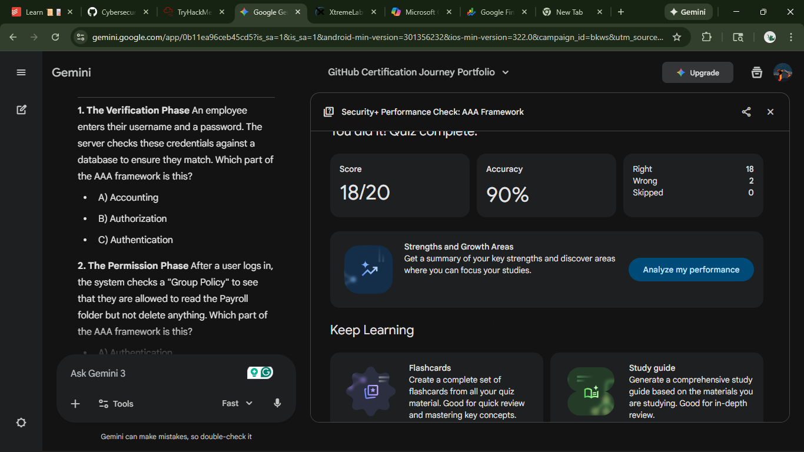

# 🛡️ Security+ High-Significance Validation: AAA Architecture
**Date:** January 27, 2026  
**Subject:** Core AAA Pillars & Protocol Engineering
**Reference:** Professor Messer Security+ (SY0-701)

---

## 🎯 Executive Summary: Top 8 High-Significance Insights
Out of the 20-question performance check, the following 8 areas represent the most critical technical concepts for network security and auditing.

### 1. Protocol Encryption Depth (RADIUS vs. TACACS+)
* **Significance:** Knowing that **TACACS+ encrypts the entire payload** while RADIUS only encrypts the password is vital for preventing sniffing of usernames or authorization arguments in transit.

### 2. Functional Separation of Auth/Authz
* **Significance:** TACACS+ allows a technician to be **Authenticated** but restricted in their **Authorization** (e.g., they can log in but cannot run the `reload` command). RADIUS combines these, offering less granularity.

### 3. The "Supplicant vs. Authenticator" Workflow
* **Significance:** Identifying that the **Authenticator** (the Switch/AP) is just a "middleman" that doesn't know your password—it simply relays your EAP packets to the AAA server.

### 4. Non-Repudiation through Accounting
* **Significance:** Establishing that **Accounting** isn't just for billing; it provides the mathematical and logical proof that a specific user cannot deny (repudiate) an action they performed.

### 5. Multi-Factor (MFA) Categorization
* **Significance:** True MFA must use **different categories**. Using two different passwords is not MFA; using a password (Knowledge) and a Smart Card (Possession) is.

### 6. The Principle of Least Privilege
* **Significance:** This is the primary goal of the **Authorization** pillar. It minimizes the "Blast Radius" if an account is compromised by ensuring users only have the bare minimum access needed.

### 7. Centralized Management vs. Local Databases
* **Significance:** Centralized AAA ensures that when an employee leaves, their access is revoked **everywhere** instantly by disabling one account, rather than manually updating every switch on the floor.

### 8. Reliability: TCP vs. UDP
* **Significance:** Understanding that **TACACS+ uses TCP** for reliable connection-oriented delivery, whereas **RADIUS uses UDP**, which is faster but requires the application to handle retransmissions.

---

## 🖼️ Evidence & Verification
### Proof of Completion
* **Lab/Quiz URL:** **[Test Url](https://gemini.google.com/share/1c8100e57af6)**
* **Completion Badge:** 

> **Note:** Screenshot above confirms 100% accuracy across 20 validation questions.

---

## 🛠️ Practical Application
During Nmap labs, these concepts manifest when encountering **Port 49 (TACACS+)** or **Ports 1812/1813 (RADIUS)**. Identifying these services immediately tells a pentester they are looking at a centralized identity gateway.

---

## 🚀 Moving Forward
- [x] Mastered AAA Architecture (High-Significance Focus)
- [ ] Next: GAP Analysis

NOTE: Source material [Prof Messer](https://www.youtube.com/watch?v=AhaZtj5P2a8&list=PLG49S3nxzAnl4QDVqK-hOnoqcSKEIDDuv&index=5)
Assessment generated by Gemini _(from the url provied)_
