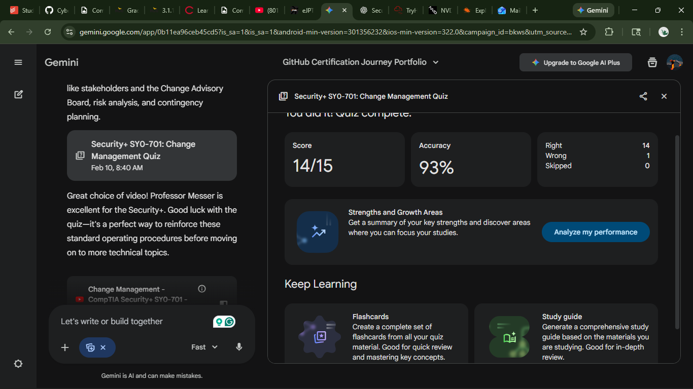

# 🛡️ CompTIA Security+ SY0-701: Change Management (Domain 1.3)

---

## 📋 Executive Summary

Change management is a critical **administrative control** that serves as a formal process for directing and controlling modifications to the IT environment. In an enterprise setting, this process ensures that changes are **coordinated, documented, and authorized** to maintain maximum uptime and system availability.

---

## 🧱 Core Components of the Process

- **Documentation**  
  Maintaining a comprehensive paper trail for every modification.

- **Scope Identification**  
  Determining exactly which systems, users, and dependencies will be affected.

- **Risk Analysis**  
  Evaluating the potential impact of a change versus the benefits of implementation.

- **Change Advisory Board (CAB)**  
  A formal body that reviews and approves or denies high-impact changes.

---

## 🛠️ Risk Mitigation & Safety Nets

- **Sandbox Testing**  
  Implementing the change in an isolated environment to observe behavior before production.

- **Backout Procedures**  
  Pre-defined steps to reverse a change if it causes unexpected failure.

- **Backups**  
  Performing a full system state capture prior to execution to ensure data recovery is possible.

---

## 📅 Operational Strategy

- **Maintenance Windows**  
  Scheduled timeframes for updates, typically during low-usage hours.

- **Change Freeze**  
  Periods where no non-essential changes are permitted, usually during critical business cycles like end-of-year processing.

---

## 💡 Reflection on Core Concepts

**Q1: Why is "Scope" more complex in an enterprise than at home?**  
Enterprise environments are highly interconnected; a single change to a core service like DNS or Active Directory can disrupt thousands of users across multiple departments.

**Q2: What is the primary function of the CAB?**  
The CAB ensures that changes are technically sound and that the business risks are understood and managed before execution.

**Q3: How does Change Management support Security?**  
It prevents configuration drift and unauthorized changes, ensuring that security patches are applied without breaking critical defenses.

**Q4: What is the difference between a Backout Plan and a Backup?**  
A Backout Plan is a tactical manual of steps to uninstall a change; a Backup is a copy of the data used to restore a system to a previous state.

**Q5: Why would an organization not apply a security patch immediately?**  
If a patch is known to conflict with a legacy application required for operations, the organization must test and find a workaround first.

**Q6: Who are the "Stakeholders"?**  
Stakeholders include IT administrators, department heads, security teams, and the end-users impacted by the system's availability.

**Q7: What is the "Technological Safe Space"?**  
The Sandbox. It allows for rigorous testing of new software or configurations without risking the production environment.

**Q8: What happens during a "Change Freeze"?**  
All non-emergency modifications are prohibited to ensure maximum stability during high-stakes periods.

---

## 📚 References & Resources

- **Professor messer [ Change management](https://youtu.be/48wRbMdHFVI?si=DQ7HE79C5DdRP7hl)** 
- ** [Gemini created test](https://gemini.google.com/share/0e0299912d81)**

---

## 🏆 Proof of Completion

