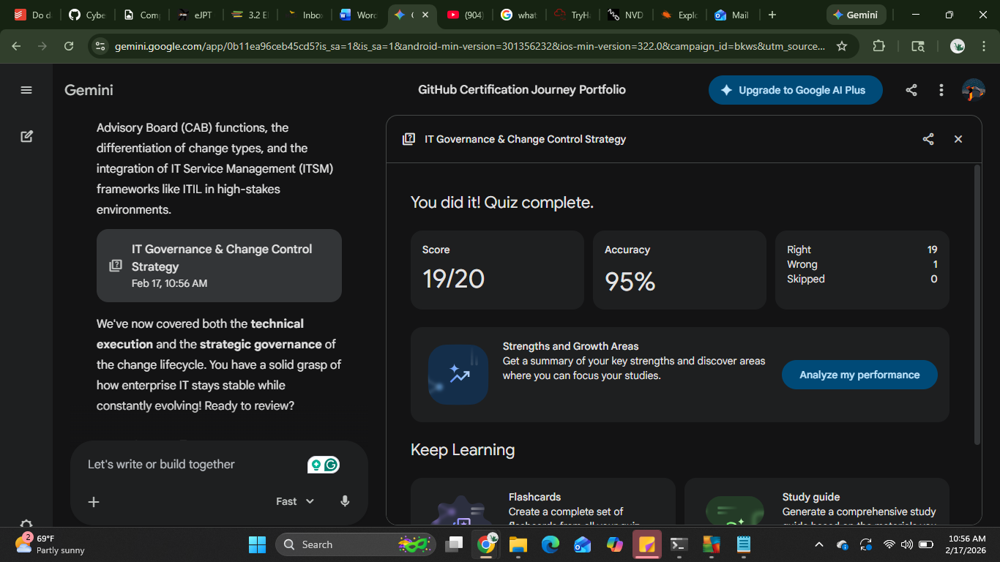

# 🛡️ CompTIA Security+ SY0-701: Technical Change Management (Domain 1.3)

## 📋 Executive Summary

Technical change management focuses on the execution and validation of modifications within the infrastructure. While administrative change management focuses on **"Why"** and **"Who,"** the technical side focuses on the **"How"** and **"Verification,"** ensuring that updates are functionally sound and do not introduce new vulnerabilities.

---

## 🧱 Core Components of the Process

### Standard Changes
Low-risk, pre-authorized, and repetitive tasks (e.g., monthly OS patching) that follow a documented template.

### Emergency Changes
High-priority modifications required to restore service or patch an active zero-day vulnerability, often bypassing the full CAB schedule.

### Request for Change (RFC)
The formal technical document that initiates the process, detailing the logic, steps, and required resources.

### Technical Impact Analysis
A deep dive into system dependencies to ensure a change in one API doesn't crash a downstream database.

---

## 🛠️ Risk Mitigation & Safety Nets

### Regression Testing
Running a suite of tests after a change to ensure that existing features still work as intended and haven't "regressed."

### Staging Environment
A "Production-Mirror" environment where the change is deployed exactly as it would be in real life to catch environment-specific bugs.

### UAT (User Acceptance Testing)
The final technical gate where actual users verify the system meets business requirements before the **"Go-Live"** signal.

---

## 📅 Operational Strategy

### Post-Implementation Review (PIR)
A technical "autopsy" performed after the change to document successes, failures, and lessons learned for the next cycle.

### Version Control & Baselines
Using tools like Git or configuration management to maintain a record of the **"Known Good State"** for rapid restoration.

---

## 💡 Reflection on Core Concepts

**Q1: What is the primary difference between a Sandbox and a Staging environment?**  
A Sandbox is for isolated, "dirty" testing of new ideas; a Staging environment is a high-fidelity replica of Production used for the final dress rehearsal of a change.

**Q2: When is an "Emergency Change" justified?**  
When there is a critical service outage or a high-severity security exploit that poses an immediate threat to the organization's mission.

**Q3: What does "Regression Testing" prevent?**  
It prevents "side-effect" bugs where fixing one part of the code accidentally breaks a completely different, unrelated feature.

**Q4: What is a "Standard Change" in a technical context?**  
A routine task with a proven track record of success, such as replacing a failed hard drive or updating antivirus definitions.

**Q5: Why is the Post-Implementation Review (PIR) necessary?**  
To determine if the change achieved its goal and to identify if the Backout Plan was effective, improving future technical responses.

**Q6: Who performs User Acceptance Testing (UAT)?**  
The actual business owners or end-users who will use the system, rather than the developers or admins who built the change.

**Q7: How does Configuration Management support technical changes?**  
It provides a "source of truth" baseline, making it easy to see exactly what changed and allowing for automated rollbacks if a baseline is violated.

**Q8: What is the risk of bypassing the CAB for an emergency change?**  
The risk is a lack of oversight, which could lead to an "emergency fix" causing a much larger, more catastrophic system failure.

---

## 📚 References & Resources

- **Professor Messer – Technical Change Management **
- **Gemini Technical Quiz ** 

---

## 🏆 Proof of Completion 

