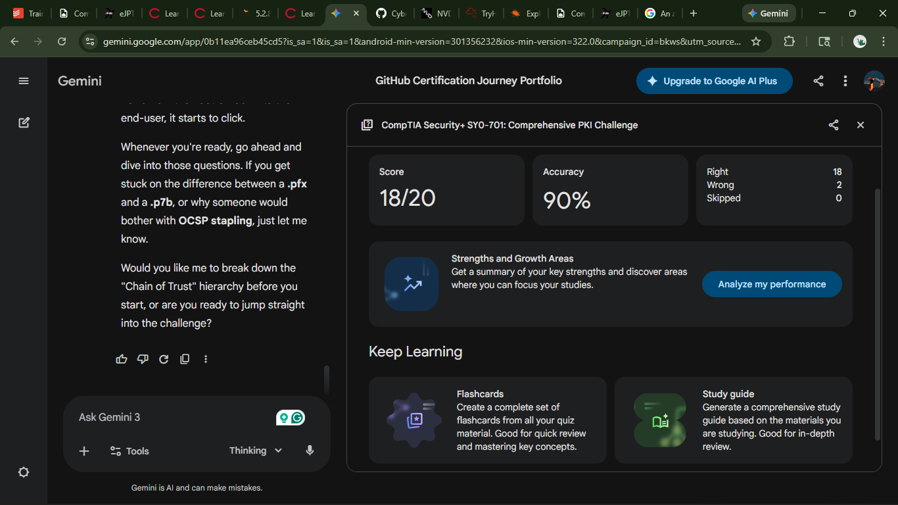

# 🛡️ PKI Brief: Security+ SY0-701

## 📋 Executive Summary

PKI provides a framework for **trust and integrity** by linking public keys to identities via digital certificates.

---

## 🧱 Core Components

* **CA**: Issues and signs certificates.
* **RA**: Vets and verifies requester identity.
* **CSR**: Data sent to CA to request a certificate.
* **Offline Root**: Disconnected CA used to prevent total trust compromise.

---

## 📂 Certificate Formats

| Format | Extension | Function | Carries | Key Type |
| --- | --- | --- | --- | --- |
| **PEM** | `.pem`, `.crt` | Standard web use | Base64 ASCII | Public (usually) |
| **DER** | `.der`, `.cer` | Java/Windows | Binary data | Public |
| **P12/PFX** | `.p12`, `.pfx` | Migration/Backup | Password-protected | **Public + Private** |
| **P7B** | `.p7b` | Chain sharing | Certificate + Chain | Public Only |

---

## 🛠️ Revocation

* **CRL**: A list of serial numbers for invalidated certificates.
* **OCSP**: A real-time protocol to check a single certificate's status.
* **Stapling**: Server provides a cached OCSP response to speed up the handshake.

---

## 💡 Reflection on Core Concepts

**Q1: What is the primary benefit of an Offline Root CA?** It prevents the organization's ultimate trust anchor from being compromised by network-based attacks.

**Q2: What is the difference between a Wildcard and a SAN certificate?** A Wildcard covers all subdomains (e.g., `*.domain.com`), while a SAN (Subject Alternative Name) allows for multiple specific, different domains (e.g., `domain.com` and `site.net`).

**Q3: When should a certificate be revoked?** Immediately upon the compromise of the private key or if the associated entity is no longer authorized.

**Q4: Which format is used specifically to export a private key?** The PKCS#12 format (.pfx or .p12).

---
## 📚 References & Resources

- Professor Messer –  [PKI Lesson](https://youtu.be/xHAMEF7-inQ?si=Syzwj2qXJ5dSbUT6)
- [PKI Quiz](https://gemini.google.com/share/787e4ea0d22a)

🏆 Proof of Completion (18/20) 

