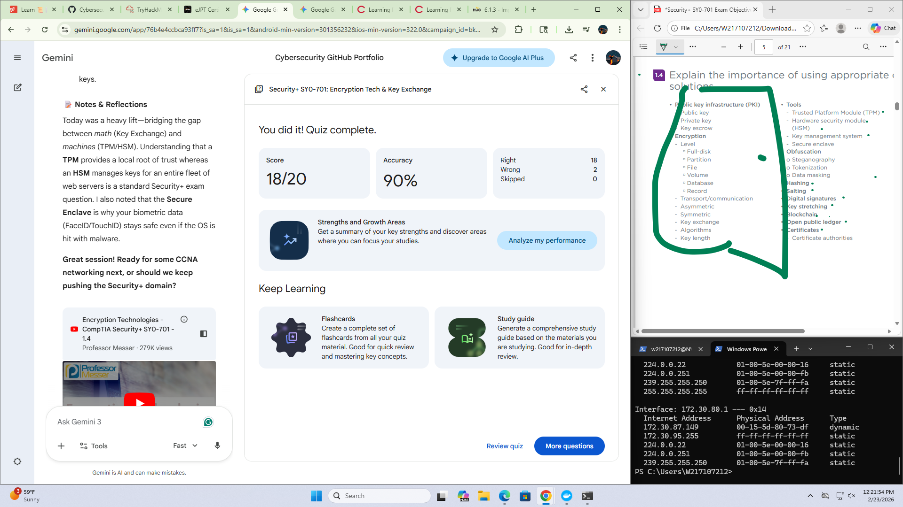

# 🛡️ CompTIA Security+ SY0-701: Key Exchange & Tech (Domain 1.4)

## 📋 Executive Summary

Secure communication requires sharing cryptographic keys without interception. This is achieved through hardware isolation (**TPM/HSM/Enclaves**) and mathematical derivation (**Diffie-Hellman**) to overcome the logistical hurdle of insecure networks.

---

## 🧱 Core Components

* **In-Band Exchange**: Key sharing over the same network being secured (uses asymmetric "wrappers").
* **Out-of-Band Exchange**: Key sharing via a separate channel (courier, phone) to avoid network sniffing.
* **Ephemeral Keys**: Temporary session keys used for a short duration and then discarded.
* **Root of Trust**: Hardware-bound keys that provide the baseline for all system cryptography.

---

## 🛠️ Encryption Solutions & States

| Solution | Scope | Platform | State | Logic |
| --- | --- | --- | --- | --- |
| **TPM** | Local Device | Motherboard | At Rest | Stores local keys; prevents hardware brute-force |
| **HSM** | Enterprise/Cloud | Data Center | At Rest/Process | High-speed centralized key mgmt for clusters |
| **Secure Enclave** | Mobile/Laptop | CPU Subsystem | In Process | Isolated processor for biometrics and boot ROM |
| **KMS** | Management | Cloud/On-Prem | Lifecycle | Centralized key rotation and audit reporting |
| **Diffie-Hellman** | Key Exchange | Network | In Transit | Derives a shared secret without transmitting it |

---

## ⚙️ Strength & Mitigation

* **Hardware Isolation**: Using separate physical chips (TPM/Enclave) to keep keys away from the main OS.
* **Asymmetric Wrapping**: Using a receiver’s public key to securely deliver a symmetric session key.
* **Key Rotation**: Automatically changing keys via KMS to limit the impact of a potential compromise.
* **Redundancy**: Clustering HSMs to ensure constant availability of cryptographic functions.

---

## 💡 Reflection on Core Concepts

**Q1: What is the primary difference between a TPM and an HSM?** A TPM is a single-device chip on a motherboard, while an HSM is a high-performance, centralized appliance for enterprise-scale key management.

**Q2: Why use asymmetric encryption to share a symmetric key?** Asymmetric is too slow for large data, so it is used only to safely "wrap" and deliver the much faster symmetric key used for the actual session.

**Q3: How does a Secure Enclave protect data if the OS is compromised?** It operates as a separate processor with its own memory and boot ROM, ensuring the main CPU cannot access its internal cryptographic secrets.

**Q4: What logistical problem does "In-Band" exchange solve?** It removes the need for slow, physical key delivery by allowing two parties to establish a secure connection instantly over the internet.

---

## 📚 References & Resources

* Professor Messer – [Key Exchange](https://youtu.be/U6BWn81P5Ec)
* Professor Messer – [Encryption Technologies](https://youtu.be/u61J0xR_XPU)

---

🏆 **Proof of Completion (20/20)** 
