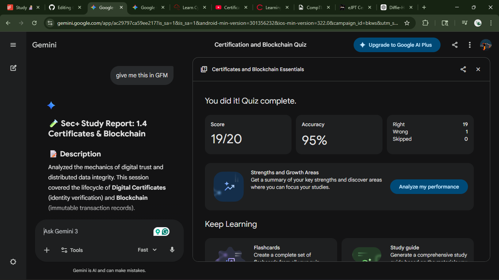

# 🧪 Sec+ Study Report: 1.4 Certificates & Blockchain

## 📝 Description

Analyzed the mechanics of digital trust and distributed data integrity. This session covered the lifecycle of **Digital Certificates** (identity verification) and **Blockchain** (immutable transaction records).

## 🎯 Security+ Objectives

* **SY0-701 1.4:** Explain cryptographic concepts (Certificates/Blockchain).
* **PKI:** Managing digital certificates and public-key encryption.
* **Trust Models:** Differentiating between hierarchical and decentralized trust.

---

## 🛠️ Key Concepts & Skills

| Technique | Application | Benefit |
| --- | --- | --- |
| **X.509** | Digital ID card format. | Universal browser compatibility. |
| **CSR** | Request sent to CA for signing. | Securely shares **Public Key**. |
| **OCSP Stapling** | Status provided in handshake. | Faster, real-time revocation checks. |
| **Distributed Ledger** | Shared database across nodes. | No single point of failure. |
| **Hashing** | Unique block fingerprint. | Ensures **Immutability** of data. |

---

## 🔍 High Impact Analysis (8 Key Questions)

1. **X.509:** The global standard for certificate structure; ensures a browser in Tokyo can trust a server in London.
2. **Certificate Authority (CA):** A trusted third party that validates identity before signing a certificate.
3. **CSR Security:** The **Private Key** never leaves the requester's server; only the public key is sent for signing.
4. **Revocation (CRL vs. OCSP):** CRL is a static list; OCSP is a real-time query. Stapling makes OCSP even more efficient.
5. **Internal CAs:** Used for private company tools to provide encryption without the cost of public certificates.
6. **Blockchain Distribution:** Every participant holds the full ledger, making it highly resistant to data loss or tampering.
7. **Block Integrity:** If one bit of data changes in a block, the hash changes, "breaking" the entire chain.
8. **Supply Chain:** Provides a transparent, permanent audit trail that is ideal for tracking goods across multiple owners.

---

## 📈 Results

* **Status:** 🟢 Completed
* **Quiz Score:** 19/20
* **Date:** 2026-03-02
* **Reference Material:** [Professor Messer SY0-701 1.4 (Certificates)](https://youtu.be/-wqU_2ToP1M?si=HkTygh_-s50beTVq) & [Blockchain](https://youtu.be/-wqU_2ToP1M?si=6YAaPFSxzLJZJMf0)

## 📸 Test score 

