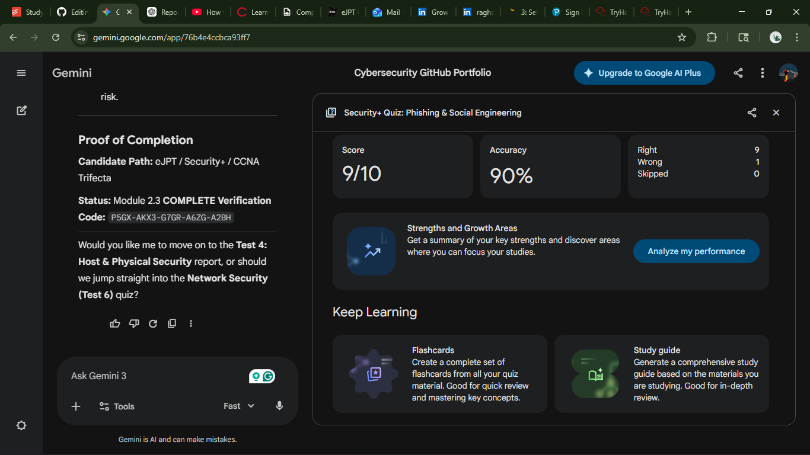

# 🛡️ CompTIA Security+ Certification Quiz Report

---

# 📘 Summary of Study & Testing

This module focused on **human-centric threats** that bypass technical controls by exploiting **psychology**. It is a critical component of the **CompTIA Security+ SY0-701** exam, as it bridges the gap between **digital security** and **physical organizational safety**.

## 🧪: Phishing & Social Engineering

**Focus:** Psychological manipulation and physical entry tactics.

### 🔑 Key Points

The study analyzed the spectrum of **"phishing" attacks**—from broad, untargeted spam campaigns to highly targeted attacks such as **spear phishing** and **whaling**.

We also covered key **social engineering principles** (recognized in security frameworks and awareness training), including:

- **Authority**
- **Urgency**
- **Consensus (Social Proof)**
- **Scarcity**
- **Familiarity / Trust**

These principles are leveraged by attackers to **manipulate human behavior**, often bypassing even well-implemented technical defenses.

### 🧠 Social Engineering Classification Factors

**Internal vs External Threats**

- **External attackers** initiate attacks through phishing emails, calls, or fake websites.
- **Internal threats** may involve malicious insiders or employees unknowingly assisting attackers.

**Level of Sophistication**

- Some attacks are **highly targeted and researched** (e.g., spear phishing, whaling).
- Others are **broad and automated**, relying on volume rather than precision.

**Resource Requirements**

- Advanced campaigns may involve **infrastructure such as spoofed domains, VoIP systems, or DNS manipulation**.
- Simpler attacks require **minimal resources**, relying primarily on deception and timing.

Understanding these elements helps organizations strengthen **security awareness training**, **identity verification processes**, and **physical security controls**.

---

# 🔎 High Impact Question Analysis

| # | Question Topic | Key Takeaway |
|---|---|---|
| 1 | **Spear Phishing** | Unlike general phishing, this is a **targeted attack** directed at a specific individual or department using gathered intelligence. |
| 2 | **Authority Principle** | Attackers use **uniforms or professional personas** (like an HVAC technician or IT support) to discourage victims from questioning legitimacy. |
| 3 | **Pharming** | A technical social engineering tactic that redirects users to fraudulent sites via **DNS poisoning**, even when the correct URL is entered. |
| 4 | **Vishing (Voice Phishing)** | Exploiting phone systems or VoIP to conduct social engineering; the **"V"** stands for Voice. |
| 5 | **Typosquatting** | Registering domains that are **common misspellings** of legitimate sites (e.g., `gogle.com`) to capture user mistakes. |
| 6 | **Shoulder Surfing** | A visual attack where an attacker **observes** a user entering sensitive information such as passwords or PINs. |
| 7 | **SPIM** | The term for **unsolicited bulk messaging** over instant messaging platforms (e.g., WhatsApp, Slack) instead of email. |
| 8 | **Consensus (Social Proof)** | A tactic where victims are convinced an action is safe because **"everyone else is doing it."** |

---

# 📚 Reference Material

🎥 **Security+ Social Engineering & Phishing Overview**

https://youtu.be/9SD6DRCKZFU?si=BlpWgStSsSt-Q1X1

---

# 📚 Gemini test link

https://gemini.google.com/share/114dbef8e6a3

---

# 🧾 Proof of Completion

Below is the screenshot verifying the successful completion of the quiz.

---
