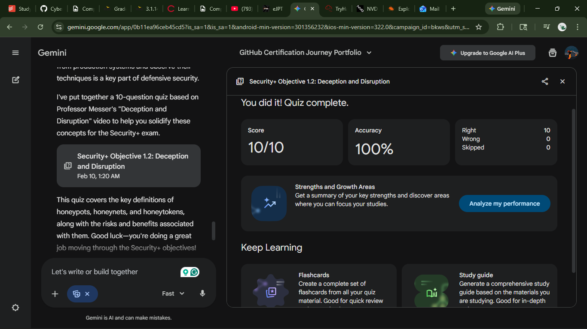

# CompTIA Security+ Study Report: Deception and Disruption

## Objective 1.2: Compare and Contrast Security Controls

This report summarizes the concepts of **honeypots**, **honeynets**, and **honeytokens** as presented in *Professor Messer's Security+ training series*.

---

## 🛡️ Executive Summary

Deception technologies are proactive defensive measures used to divert, track, and analyze unauthorized activity within a network. Unlike traditional security controls that block access, these tools **invite interaction** to gather valuable threat intelligence.

---

## 📋 Core Concepts

| Technology   | Definition                                                                 | Primary Goal                                                                 |
|-------------|-----------------------------------------------------------------------------|------------------------------------------------------------------------------|
| **Honeypot** | A single decoy system or server designed to look vulnerable                 | To attract and observe an attacker in a controlled environment              |
| **Honeynet** | A network of multiple honeypots that simulate an entire subnet              | To observe how an attacker pivots through a network (lateral movement)      |
| **Honeytoken** | Specific digital assets (files, credentials, API keys) that are fake     | To detect unauthorized data access or "leaks" via triggered alerts          |

---

## 🔍 Key Technical Details

### 1. Interaction Levels

- **Low-interaction**
  - Simulates certain services (e.g., a fake SSH login)
  - Less risky but provides limited information

- **High-interaction**
  - Uses real operating systems and applications
  - Higher risk of compromise but provides deep forensic data

---

### 2. Benefits of Deception

- **Low False Positives**
  - Legitimate users have no reason to access a honeypot
  - Any interaction is almost certainly malicious

- **Intelligence Gathering**
  - Enables identification of attacker **TTPs** (Tactics, Techniques, and Procedures)

- **Resource Wasting**
  - Forces attackers to spend time and resources on a useless target

---

### 3. Critical Risks

- **Pivoting**
  - If the honeypot is not properly isolated (DMZ/VLAN), it can be used as a bridge into the production network

- **Fingerprinting**
  - Advanced attackers may use anti-honeypot techniques to detect simulated environments

---

## 📝 Self-Assessment Highlights

- **Scenario:** An administrator places a fake file named `passwords.txt` on a server  
  - **Classification:** Honeytoken

- **Scenario:** A company builds a fake virtual datacenter to watch a ransomware strain spread  
  - **Classification:** Honeynet

---

## 🔗 References

- Professor Messer Video: [Deception and Disruption](https://youtu.be/X_qfMVty4ts?si=L9KU8rrrdy-kaoZ5)  
- CompTIA Security+ Exam Objectives (Section 1.2)

****
*Created as part of the **SY0-701** certification path.*
