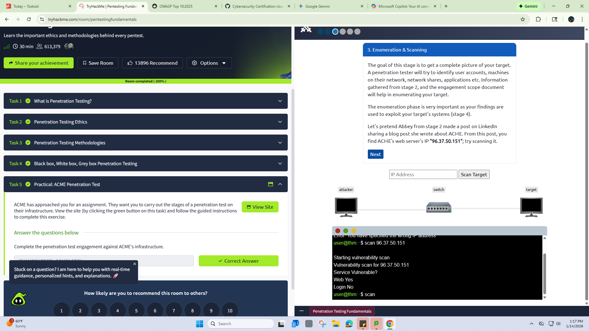
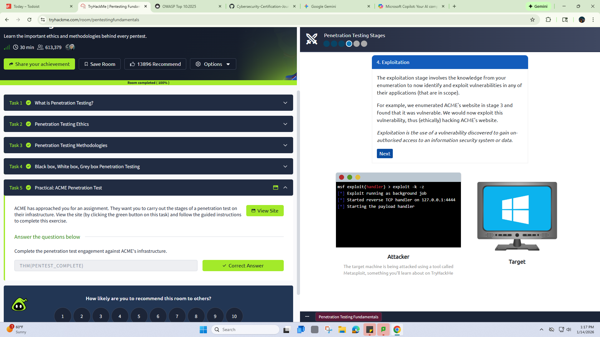

#*From the room I took today on thm, here's what I learned*

# 🕵️ Penetration Testing Methodology
*Professional standards and frameworks used in ethical hacking engagements.*

## 🛣️ The REEPP Flow
I created the **REEPP** acronym to remember and have a structured approach to every targt:
1. **Reconnaissance:** Passive gathering of information.
2. **Enumeration:** Active scanning to find open ports and versions.
3. **Exploitation:** Using a specific exploit to bypass security.
4. **Privilege Escalation:** Moving from a low-level user to 'Root' or 'System' admin.
5. **Post-Exploitation:** Documenting findings, pivoting, and preparing the final Report.

## 📚 Industry Frameworks
* **OSSTMM:** Focused on scientific metrics and operational security (covers all three; web application, systems, and network).
* **OWASP:** The gold standard for Web Application security (Top 10).
* **NIST:** Comprehensive security standards used for critical infrastructure.
* **NCSC CAF:** Government-backed framework for organizational cyber-resilience.

## 🏗️ Pentesting Perspectives
* *I learned about the 3 pentesting perspectives*
  
**⚪White Box**: Full Disclosure. The tester has complete access to the network diagrams, source code, and IP addresses.

**🔘Grey Box**: Partial Disclosure. The tester is given limited information, like a standard user login or a specific set of IP addresses.

**⚫Black Box**: Zero Disclosure. The tester starts with nothing but a company name. You must perform full reconnaissance to find the IP addresses and vulnerabilities.

## 🛠️ Key Terminology
| Term | Definition |
| :--- | :--- |
| **Vulnerability** | A weakness in the system (e.g., an unpatched service). |
| **Exploit** | The method or code used to take advantage of a vulnerability. |
| **Payload** | The actual action or "malware" delivered once the exploit succeeds. |
| **Tool** | The software (like Hydra or Nmap) used to automate the process. |

---

## 🔬 Lab Case Study: Methodology in Action
*Scenario: TryHackMe Pentesting Fundamentals Practical Lab*

### 1. The Workflow Applied
* **Information Gathering:** Analyzed a provided social media post for clues.
* **Reconnaissance:** Performed a **Reverse DNS Search** to resolve a domain to a hidden IP address.
* **Exploitation:** Used the discovered IP to gain initial entry into the system.
* **Privilege Escalation:** Identified permission misconfigurations to escalate from a standard user to **Root**.

### 🚩 Evidence of Completion
* **Lab Source:** [THM: Pentesting Fundamentals](https://tryhackme.com/room/pentestingfundamentals?utm_campaign=social_share&utm_medium=social&utm_content=share-completed-room&utm_source=copy&sharerId=68be8259779eb658bbc19236)
  
* **Final Flag:** `THM{PENTEST_COMPLETE}`🟢
* **Proof Image:** 

