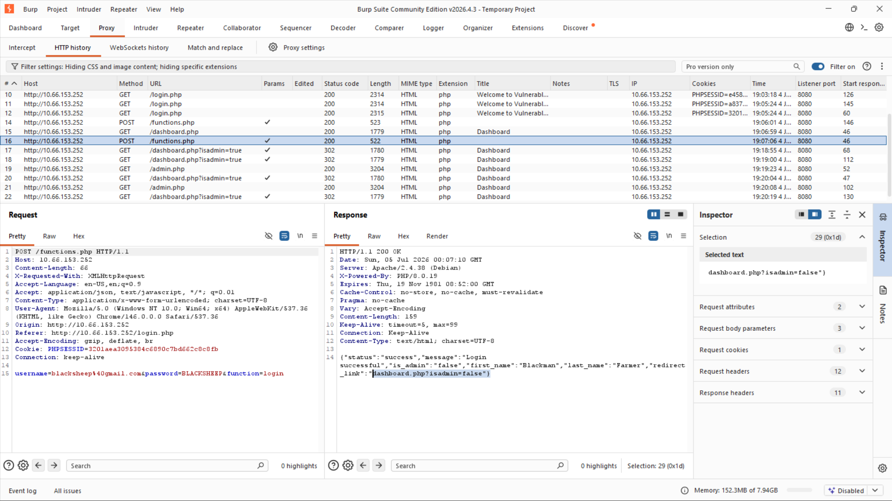
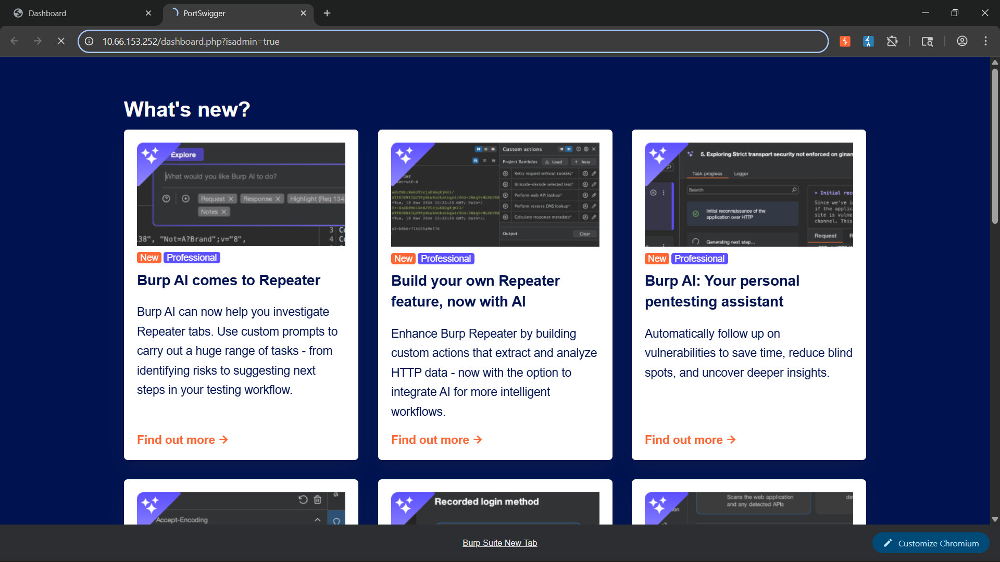
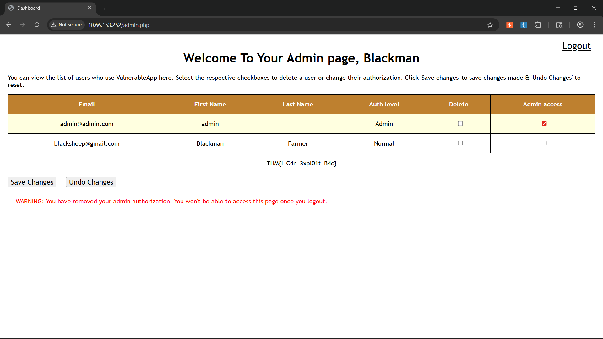
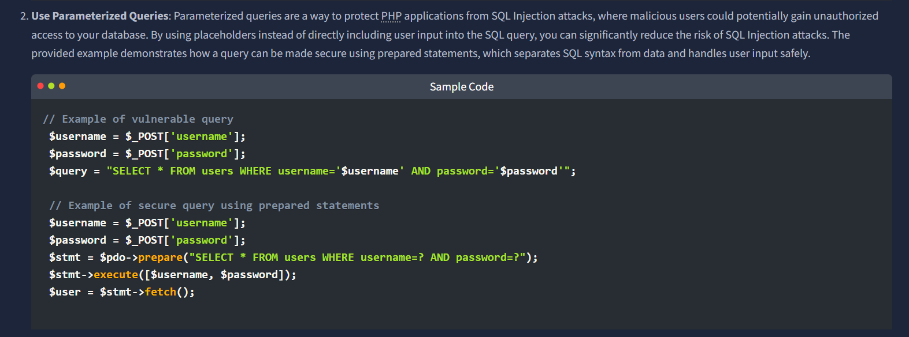
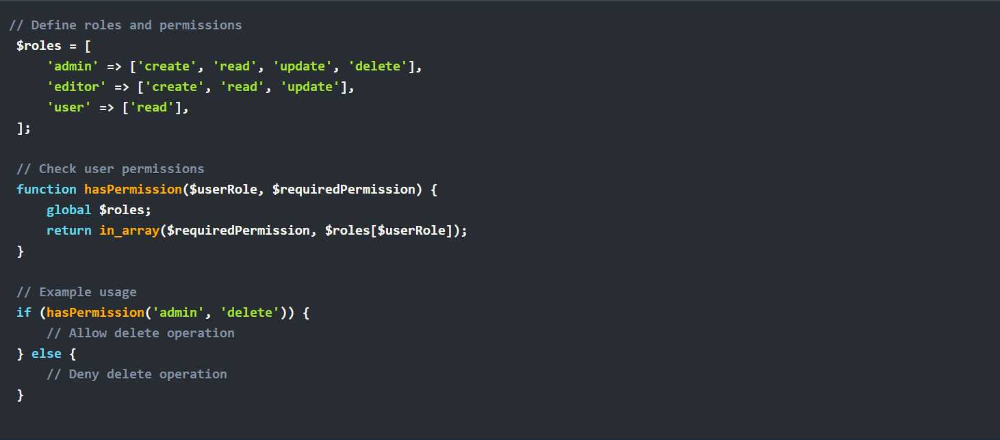
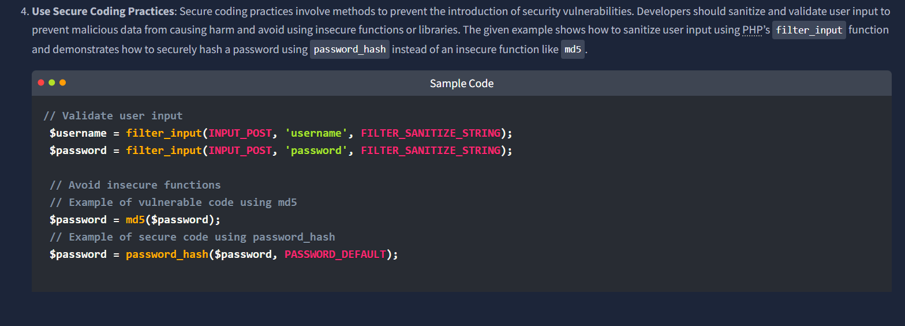

# Lab Summary: Client-Side Parameter Tampering

## 1. Study & Test Parameters
* **Focus Module:** CompTIA Security+ Domain 4.6 (Identity and Access Management) / eJPT Web Assessment
* **Lab Environment:** TryHackMe - Broken Access Control Room
* **Captured Flag:** `THM{I_C4n_3xpl01t_B4c}`

---

## 2. The Exploit Chain

* **Triage:** Routed traffic through Burp Suite to establish a normal authentication baseline with a low-privilege account.
* **Audit:** Analyzed the Burp HTTP history log for the login `POST` request to `/functions.php`. Found that the server successfully authenticated the user but returned a JSON response leaking routing parameters: `{"status":"success", ..., "redirect_link":"dashboard.php?isadmin=false"}`
* **Escalation:** Bypassed proxy interception entirely and edited the parameter directly in the browser address bar. Forcing the URL query string from `isadmin=false` to `isadmin=true` completely bypassed the authorization layer because the backend server implicitly trusted the client parameter without checking a session state.

---

## 3. Engineering Mitigations

### Server-Side Session Validation
User roles must be tied directly to secure server sessions or cryptographically signed tokens (JWTs) instead of raw URL parameters.
* *Reference Implementation:* 

### Role-Based Access Control (RBAC)
Implement a centralized authorization middleware framework to validate user permissions. Enforce a fail-safe default where missing or malformed states result in an immediate drop of the request.
* *Reference Implementation:* 

### Parameterized Queries
Bind all user inputs to SQL queries using Prepared Statements to prevent attackers from using parameter tampering vectors to inject malicious database code.
* *Reference Implementation:* 

### Secure Coding Practices
Utilize server-side sanitization APIs (such as PHP's `filter_input`) and swap weak legacy hashing routines (`md5`) for secure algorithms (`password_hash`).
* *Reference Implementation:* 

---

## 4. Reference Material
* **OWASP Core Standard:** A01:2021 – Broken Access Control
