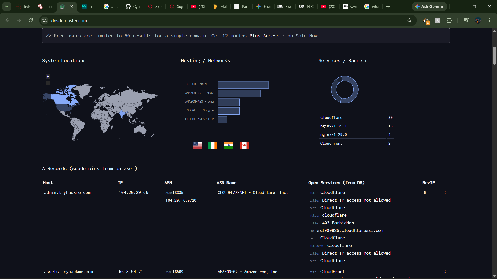
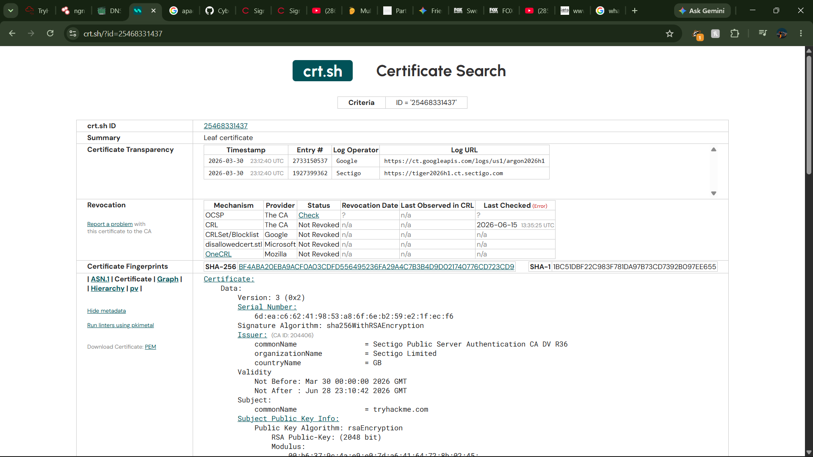
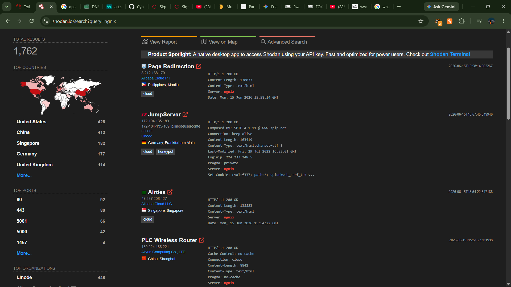

# TryHackMe: Passive Reconnaissance Lab Report

## Study Overview
This lab focused on gathering intelligence without direct interaction with the target network, representing the stealthiest phase of external security assessments. By querying public third-party registries, distributed DNS caches, and specialized internet directories, an analyst can map an entire external attack surface completely undetected by a target's internal logging or security operations centers.

## Key Concepts Studied
* **Passive vs. Active Reconnaissance:** Defining the exact boundary between silent public footprinting and active network scanning.
* **WHOIS and RDAP Directories:** Extracting domain registration data, timeline parameters, and authoritative name server designations.
* **Passive DNS Interrogation:** Querying public resolvers to pull configuration records without sending traffic to the target's nameservers.
* **Subdomain Enumeration vectors:** Utilizing public Certificate Transparency (CT) logs to find hidden corporate hosting structures.
* **Exposed Asset Ingestion:** Using pre-cached internet crawlers to identify configuration parameters and active ports.

---

## High Impact Questions & Practical Analysis

### Q1: What is the primary operational advantage of passive reconnaissance?
Passive reconnaissance relies entirely on querying third-party public repositories rather than transmitting packets directly to the target. This ensures the target organization's security operation center (SOC) and firewalls record zero entries of the footprinting attempt.

### Q2: What core infrastructure information is revealed through a standard WHOIS query?
A standard WHOIS query exposes critical domain registration parameters, including the sponsoring registrar, the creation and expiration dates of the domain, and the designated authoritative name servers routing the target's traffic.

### Q3: Why is executing DNS queries through a public resolver like 1.1.1.1 considered passive?
When running lookups against public Anycast resolvers, your query stops at the resolver's public cache. Because your terminal never interacts with the target's authoritative nameservers directly, the target logs no record of your search traffic.

### Q4: What is the significance of a DNS TXT record during the information gathering phase?
TXT records are frequently used by organizations to establish email security policies and verify third-party web configurations. Checking these records can expose public configuration strings for SPF, DKIM, and DMARC policies.

### Q5: What makes the dig utility preferred over nslookup in modern terminal workflows?
The `dig` utility is the modern standard for Unix/Linux environments. It delivers highly structured, script-ready console outputs by default and natively displays the exact Time to Live (TTL) values for every record returned.

### Q6: How does DNSDumpster assist a reconnaissance workflow beyond standard lookup tools?
DNSDumpster acts as an advanced domain research platform that automatically aggregates subdomains, clusters historical DNS records, maps MX mail routing targets, and generates an interconnected visual graph of the organization's public infrastructure.

### Q7: Why are Certificate Transparency (CT) logs highly effective for mapping hidden subdomains?
Whenever a Certificate Authority issues an SSL/TLS certificate, it must log the transaction in a public registry. Tools like crt.sh can query these historical paths, revealing development or test subdomains that companies forget to hide from the public.

### Q8: How does Shodan provide service banner data without interacting with your specific target?
Shodan continuously crawls the entire global IPv4 address space 24/7, archiving open ports and raw device banners. When you run a query on Shodan, you are reading historical snapshot data from their servers, meaning no live traffic hits your target.

---

## Reference Material

### Command Quick-Reference

| Purpose | Command Line Example |
| :--- | :--- |
| Lookup WHOIS record | `whois tryhackme.com` |
| Lookup DNS A records (legacy) | `nslookup -type=A tryhackme.com` |
| Lookup DNS MX records at specific server (legacy) | `nslookup -type=MX tryhackme.com 1.1.1.1` |
| Lookup DNS TXT records (legacy) | `nslookup -type=TXT tryhackme.com` |
| Lookup DNS A records (recommended) | `dig tryhackme.com A` |
| Lookup DNS MX records at specific server (recommended) | `dig @1.1.1.1 tryhackme.com MX` |
| Lookup DNS TXT records (recommended) | `dig tryhackme.com TXT` |

### Web Recon Platforms
* **Certificate Log Ledger:** [crt.sh](https://crt.sh)
* **Domain Subdomain Graphing:** [DNSDumpster](https://dnsdumpster.com)
* **Internet Threat Directory:** [Shodan.io](https://shodan.io)

---

## Proof of Completion
* **Room Progress Achieved:** 100% Complete
* **Final Target Terminal Flag:** `THM{a5b8392983ed36acb0272971e438d78}`

