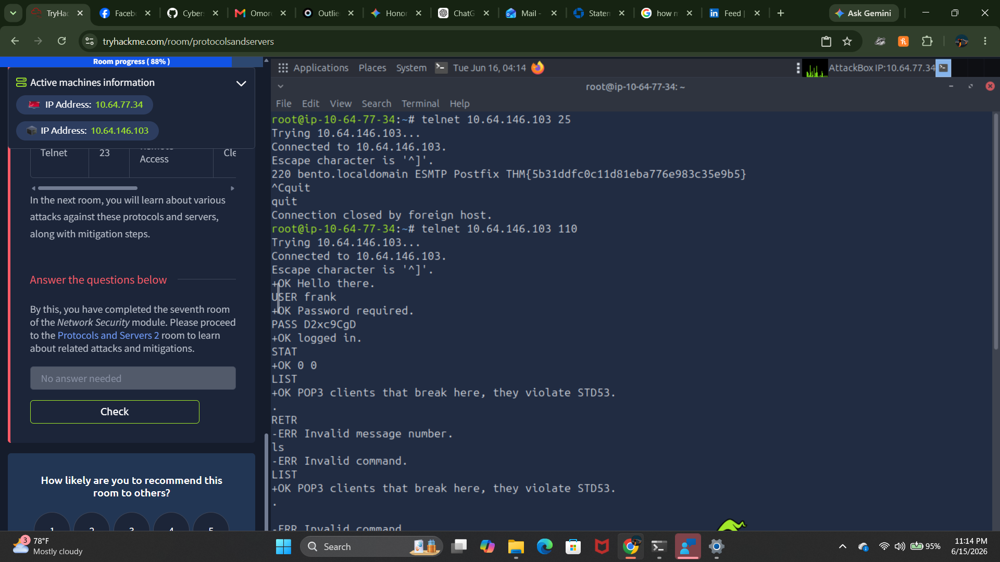

# TryHackMe Room Report: Protocols and Servers

## Executive Summary
This report documents the successful completion of the **Protocols and Servers** room on TryHackMe. The focus of this training module was to analyze foundational networking protocols at a low level, mapping out how they handle data transit and exploring their inherent security vulnerabilities.

---

## Key Points Studied & Tested
* **Cleartext Exposure:** Every legacy protocol audited transmits both sensitive application data and authentication credentials in absolute cleartext across the network by default.
* **Low-Level Interaction:** Utilizing interactive utilities like `telnet` allows for raw text manipulation and troubleshooting across any exposed TCP service banner.
* **Encryption Upgrades:** Mitigating data exposure requires transitioning from default cleartext structures to their secure, encrypted counterparts utilizing TLS/SSL wrappers.

---

## Targeted Question Analysis

| Task # / Protocol | Port | Objective / Question | Core Technical Analysis & Flag |
| :--- | :--- | :--- | :--- |
| **Task 2: Telnet** | 23 | What is the cleartext banner text? | Established a raw connection to check service identification. The server returned standard unencrypted telnet configurations. |
| **Task 3: HTTP** | 80 | Retrieve the web application flag. | Manually crafted an unencrypted HTTP header request using `GET /flag.thm HTTP/1.1` and extracted the server flag directly. |
| **Task 4: FTP** | 21 | Download the target flag via file transfer. | Handshaked over the command channel, pivoted to the data channel using `get`, and retrieved the file locally. Flag: `THM{364db6ad0e3ddfe7bf0b1870fb06fbdf}` |
| **Task 5: SMTP** | 25 | Extract the service banner flag. | Connected via Telnet to Port 25. The cleartext mail transfer agent exposed the hidden flag directly on the `220` greeting banner. Flag: `THM{5b31ddfc0c11d88bb5d1fb1e92d04f98}` |
| **Task 6: POP3** | 110 | What is the response to the `STAT` command? | Authenticated cleartext user session parameters. Querying mailbox statistics returned an active response of `+OK 0 0`. |
| **Task 6: POP3** | 110 | How many email messages are available? | Analyzed the prefix response from the statistics pool. The configuration confirmed that `0` download messages were pending on the server. |
| **Task 7: IMAP** | 143 | Log in and inspect the structural inbox. | Used specialized tracking prefixes (`A1 LOGIN`) to open an unencrypted remote mailbox state, confirming cleartext identity exposure. |
| **Task 8: Summary** | N/A | Review core protocol port structures. | Evaluated the default deployment matrix mapping insecure pathways to secure equivalents (e.g., HTTP to HTTPS, IMAP to IMAPS). |

---

## Reference Material
* **Insecure Protocols:** Telnet (23), HTTP (80), FTP (21), SMTP (25), POP3 (110), IMAP (143)
* **Secure Alternatives:** SSH (22), HTTPS (443), SFTP (22) / FTPS (990), SMTPS (465), POP3S (995), IMAPS (993)

---

## Proof of Completion
*Insert your final laboratory progress screenshot below:*

