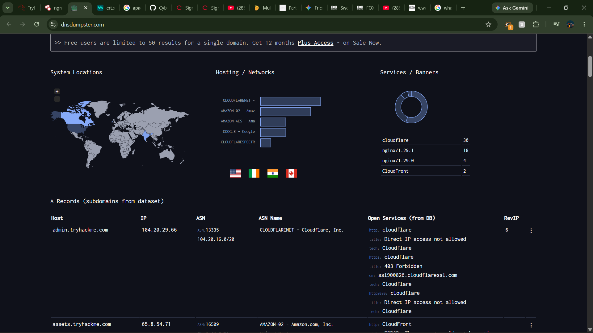

# Lab Report: TryHackMe - Passive Reconnaissance

- **Certification Track:** eJPT
- **Domain:** Assessment Methodologies
- **Platform:** TryHackMe
- **Date Completed:** 2026-10-03
- **Time Invested:** 1.0 Hours
- **Core Skills & Tools:** dig, crt.sh, Shodan

---

## 1. Executive Summary
The target environment was a corporate digital footprint. The objective was to map the entire external infrastructure completely under the radar without interacting with live servers, demonstrating the risks of exposed public records.

## 2. Key Objectives & Methodologies
* Stealth DNS interrogation using public resolvers.
* Certificate Transparency auditing to discover hidden subdomains.
* Exposed footprint synthesis using pre-cached databases like Shodan.

## 3. Commands Executed & Payloads Used
`ash
dig mx target.com
dig txt target.com
curl -s https://crt.sh/?q=target.com&output=json
`

## 4. Artifact Embedding
| PROOF-01 | Shodan search and DNS results |  |

## 5. Defensive Takeaways
* **Root Cause:** Lack of awareness regarding the organization's public footprint, leaving DNS alterations and transparency ledgers unmonitored.
* **Remediation:** Security teams must proactively audit their external presence. Set up alerts on Shodan, monitor public DNS alterations, and track Certificate Transparency entries for rogue developer setups.
