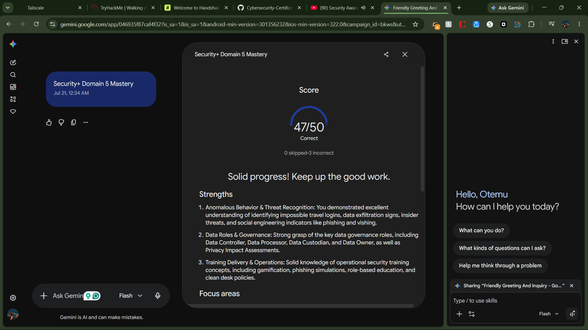

# Lab Report: Nmap Advanced Discovery

- **Certification Track:** eJPT
- **Domain:** Network Attacks
- **Platform:** TryHackMe
- **Date Completed:** 2026-10-03
- **Time Invested:** 1.0 Hours
- **Core Skills & Tools:** 
map, ping, 	raceroute

---

## 1. Executive Summary
The target environment involved a segmented network requiring deep enumeration. The objective was to map network topologies and discover exposed services while evading basic detection mechanisms.

## 2. Key Objectives & Methodologies
* Target enumeration across local and remote subnets.
* Verify open ports and running services.
* Map network paths to discover segmentation rules.

## 3. Commands Executed & Payloads Used
`ash
nmap -p- -sS -T4 -A 10.10.10.1
nmap -sV --script vuln 10.10.10.1
`

## 4. Artifact Embedding
| PROOF-01 | Nmap extensive scan results |  |

## 5. Defensive Takeaways
* **Root Cause:** Overly permissive firewall rules exposing management services to untrusted networks.
* **Remediation:** Implement default-deny firewall policies. Restrict service exposure and employ intrusion detection systems (IDS) to monitor for unauthorized scanning activity.
