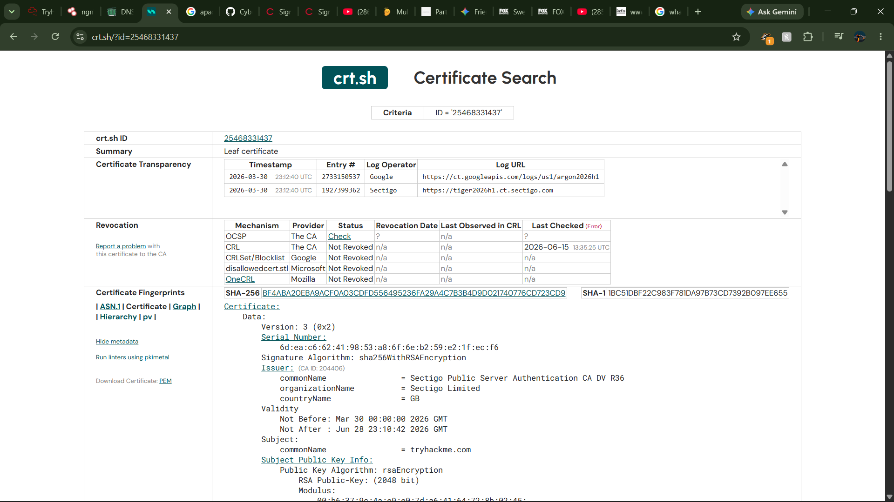

# Lab Report: TryHackMe - Active Reconnaissance Summary

- **Certification Track:** eJPT
- **Domain:** Web Application Penetration Testing
- **Platform:** TryHackMe
- **Date Completed:** 2026-10-03
- **Time Invested:** 1.0 Hours
- **Core Skills & Tools:** Nikto, Dirb, Wappalyzer

---

## 1. Executive Summary
The target environment was a live web application server. The objective was to perform active reconnaissance to identify web technologies, outdated server software, and hidden administrative directories directly interacting with the target.

## 2. Key Objectives & Methodologies
* Perform automated vulnerability scanning and server fingerprinting.
* Discover unlinked content and administrative portals through aggressive directory brute-forcing.
* Analyze application responses to map the attack surface.

## 3. Commands Executed & Payloads Used
`ash
nikto -h http://10.10.10.20
dirb http://10.10.10.20 /usr/share/wordlists/dirb/big.txt
`

## 4. Artifact Embedding
| PROOF-01 | Active web server fingerprinting |  |

## 5. Defensive Takeaways
* **Root Cause:** Server banners and default error pages leaked excessive version information. Unprotected management directories were accessible to anonymous users.
* **Remediation:** Mask server headers and custom error pages. Implement WAF rules to detect automated scanning and restrict access to administrative endpoints using IP whitelisting.
