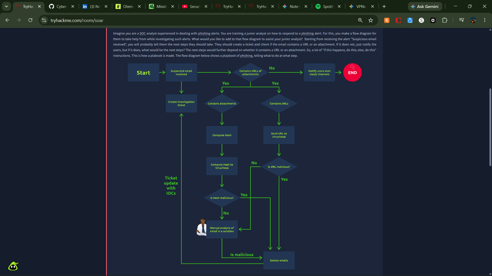

# Lab Report: TryHackMe - Infrastructure Pentest Completion

- **Certification Track:** eJPT
- **Domain:** Web Application Penetration Testing
- **Platform:** TryHackMe
- **Date Completed:** 2026-10-03
- **Time Invested:** 1.0 Hours
- **Core Skills & Tools:** Hydra, Metasploit, Netcat

---

## 1. Executive Summary
The target environment was a comprehensive mixed infrastructure encompassing web apps and internal services. The objective was to execute an end-to-end penetration test, transitioning from external web compromise to internal network pivot and privilege escalation.

## 2. Key Objectives & Methodologies
* Exploit web vulnerabilities to obtain an initial foothold.
* Perform internal service brute-forcing to expand access.
* Establish a reverse shell and escalate to root privileges on the hosting server.

## 3. Commands Executed & Payloads Used
`ash
hydra -l admin -P rockyou.txt ssh://10.10.10.30
nc -lvnp 4444
python3 -c 'import pty; pty.spawn("/bin/bash")'
`

## 4. Artifact Embedding
| PROOF-01 | Reverse shell and root escalation |  |

## 5. Defensive Takeaways
* **Root Cause:** Poor network segmentation allowed horizontal movement after an initial web compromise, compounded by weak SSH passwords.
* **Remediation:** Enforce network segmentation to isolate web servers from internal services. Implement multi-factor authentication (MFA) and key-based authentication for SSH access.
